# 公式	

## 排列组合

### 排列

#### 线性排列

$$
P(n,r)=\frac{n!}{\left(n-r\right)!}
$$

#### 圆排列

$n$ 个数的$r$排列数是
$$
\frac{P(n,r)}{r}
$$

#### 项链数

$n$ 个不同的珠子串成一串项链,则得到不同的项链数为
$$
p=\begin{cases}
1,\  \ \left( n<=2\right) \\
\frac{(n-1)!}{2},\   \ \left( otherwise\right)
\end{cases}
$$

#### 多重集的排列

有$k$ 种元素,每种$n_1,n_2,\dots n_k$个,的排列公式
$$\frac{n!}{\prod_{i=1}^{k}\left(n_i!\right)} $$
或记为$$\binom{n}{n1,n2,\cdots,n_k} $$

##### 例子

在$n\times n$的棋盘摆放$n$个棋子,使得每行每列只有一个的摆放方法有$n!$种.
若有$k$种颜色,分别为 $n_1,n_2,\dots n_k$ 个,则摆放方法有
$$n!\cdot\frac{n!}{\prod_{i=1}^{k}\left(n_i!\right)} $$

### 组合

$$\binom{n}{r}=\frac{P(n,r)}{r!} $$

#### 多重集的组合

设$S$是有$k$ 种元素的集合,每种元素无限个$(\geq r)$,则其$r$ 组合的个数为
$$\binom{r+k-1}{r} $$
**证明:**
设第$i$种元素有$x_i$ 个,显然有$x_1+x_2+\dots+x_k=r(x_i\geq 0)$
该题就转化求解的个数.
设$T=\{r\cdot1,(k-1)\cdot| \} $,$|$分割为$k$ 个区域,第$i$ 个区域的$1$ 的个数对应$x_i$,故多重集合$T$ 的排列数就是该题答案,为$$\frac{(r+k-1)!}{r!(k-1)!}=\binom{r+k-1}{r} $$

#### 组合恒等式

一般采用**双计数**方法证明.即**算两次**的技巧

#### 1(Pascal公式)

$$\binom{n}{k}=\binom{n-1}{k}+\binom{n-1}{k-1} $$

#### 2

$$\sum_{i=0}^{n} \binom{n}{i}=2^n $$

#### 3

$$ m\cdot \binom{n}{m}=n\cdot \binom{n-1}{m-1} $$

#### 4

$$ \sum_{k=1}^{n} k\cdot\binom{n}{k}=n\cdot \sum_{k=1}^{n}\binom{n-1}{k-1}=n\cdot2^{n-1} $$

#### 3(朱世杰恒等式)

$$
\binom{m+n+1}{n+1}=\sum_{i=0}^{m} \binom{n+i}{n}
$$

**证明:**
注意到$(x+1)^{m+n+1}$的$x^{n+1}$ 的系数为$\binom{m+n+1}{n+1}$,而我们可以将其看成$m+n+1$ 个$(x+1)$相乘,取了$n+1$ 次$x$,设$c_i$ 为第$i$项为第一次取$x$ 的种类数,那么$c_i=\binom{m+n+1-i}{n} $ 其中$1 \leq i\leq m+2 $ 又有
$$
\sum_{i=1}^{m+1} \binom{m+n+1-i}{n}=\sum_{i=1}^{m+1} \binom{n+i-1}{n}= \sum_{i=0}^{m} \binom{n+i}{n}
$$
得证.

#### 4(范德蒙德恒等式)

$$
\binom{a+b}{n}=\sum_{i=0}^{k}\binom{a}{i}\binom{b}{n-i}
$$

**特别地**:
$$
\binom{2n}{n}=\sum_{i=0}^{n}\binom{n}{i}\binom{n}{n-i}
$$


##### 例1

证明$m$ 个$a$,和最多$n$ 个b的排列数等于
$$\binom{m+n+1}{m+1} $$
**证明:**
先排$a$,然后再$m+1$个位置插入$b$,满足$x_1+x_2+\dots +x_{m+1}\leq n$
令$y=n-左式 \geq0$,且$y+左式=n$,解的个数为
$$\binom{m+n+1}{m+1} $$

#####  例2

证明:最多 $m$ 个$a$,和最多$n$ 个b的排列数等于
$$
\binom{n+m+2}{m+1}-1
$$
**证明:** 
$$
\iff\sum_{i=0}^{m} \binom{i+n+1}{n}=\sum_{i=0}^{m+1} \binom{i+n}{n}-1=\binom{n+m+2}{m+1}-1
$$

## 二项式系数

### 帕斯卡三角形

本章核心**帕斯卡公式**
$$
\binom{n}{k}=\binom{n-1}{k}+\binom{n-1}{k-1}
$$

### 二项式定理

$$
(x+y)^n=\sum_{k=0}^{n}\binom{n}{k}x^{n-k}y^{k}
$$

#### 单峰性

二项式系数是单峰序列
最大项为

$$
\binom{n}{\lfloor \frac{n}{2} \rfloor} and\binom{n}{\lceil\frac{n}{2} \rceil}
$$

#### Sperner定理

设$S$是$n$ 元素集合.那么$S$上的一个反链至多包含$\binom{n}{\lfloor \frac{n}{2} \rfloor} $个集合.

### 多项式定理

#### 多项式系数

$$
\binom{n}{n_1,n_2,\dots,n_t}=\frac{n!}{n_1!n_2!\cdots n_t!}
$$

从而
$$
\binom{n}{k}=\binom{n}{k,n-k}
$$

#### 多项式系数的帕斯卡公式

$$
\binom{n}{n_1,n_2,\cdots,n_t}=\binom{n-1}{n_1-1,n_2,\cdots,n_t}+\binom{n-1}{n_1,n_2-1,\cdots,n_t}+\cdots+\binom{n-1}{n_1,n_2,\cdots,n_t-1}
$$

#### 多项式定理

$$
(x_1+s_2+\cdots+x_t)^n=\sum \binom{n}{n_1,n_2,\cdots,n_t}x_1^{n_1}x_x^{n_2}\cdots x_t^{n_t}
$$

#### 牛顿多项式定理

特殊的有
$$
(1+z)^a=\sum_{k=0}^{\infty} \binom{a}{n} z^k(a\in R,|z|<1)
$$

### 偏序集

设$(X,\leq)$是有限偏序集合,而$r$是链的最大大小,则$X$可以被划分为$r$个反链,但不能被划分成小于$r$个反链.

#### Dilworth定理

设$(X,\leq)$是有限偏序集合,而$m$是反链的最大大小,则$X$可以被划分为$m$个链,但不能被划分成小于$m$个链.
$$
\begin{align*}
\binom{n-1}{k-1}+ \binom{n-1}{k} =& \frac{(n-1)!}{(k-1)!(n-k)!} + \frac{(n-1)!}{k!(n-k-1)!} \\
=&\frac{(n-1)!}{(k-1)!(n-k-1)!} \times(\frac{1}{n-k}+ \frac{1}{k}) \\
=&\frac{(n-1)!}{(k-1)!(n-k-1)!} \times \frac{k+(n-k)}{k(n-k)} \\
=&\frac{n!}{k!(n-k)!} = \binom{n}{k}
\end{align*}
$$


## 抽屉原理

### 简单形式

如果要把$n+1$个物体放进$n$个盒子,那么至少有一个盒子有至少$2$个物体

### 加强形式

设$q_1,q_2,\dots q_n$ 是正整数.如果将$q_1+q_2+\dots +q_n-n+1$个物体放进$n$ 个盒子.那么要么要么第一个盒子含有$q_1$个物体,$\dots$ ,要么第$n$ 个物体含有$q_n$个物体.

## Ramsey定理

### 基本形式

在$6$个人(或者更多),要么有$3$个人互相认识,要么有$3$个人互相都不认识.

### 抽象化

对于$K_n(n \geq 6)$我们给他的所有边染红色或蓝色,总存在一个红$K_3$ 或蓝$K_3$,记为$K_6\rightarrow K_3,K_3$

#### 证明

对于任意一点$p$,从他出去有$5$条边,因为红和蓝地位等价,不妨设,红比蓝多.由抽屉原理,红色边数量至少是$3$,对于这$3$跳边对应的三个顶点之间的三条边,若一条然红色就会有一个红$K_3$,否则有一个蓝$K_3$.

### 一般化

若$m,n \geq2 $,存在正整数$p$,使得$K_p\rightarrow K_m,K_n $

事实上,注意到若$p$成立,则对于$q\geq p$都成立,取一个子图即可.
我们记Ramsey数$r(m,n)$为使之成立的最小的数.Ramsey定理保证这样的数一定存在.
注意到$$r(m,n)=r(n,m)$$
以及$$r(2,m)=m $$ 当$m\geq2$时,$r(2,m)$称为平凡的Ramsey数(交换同理).

#### 证明

使用数学归纳法.
我们有$r(m,2),r(2,n)$成立.
然后由$r(m-1,n),r(m,n-1)\rightarrow r(m,n) $即可.

#### 性质

1. $$r(m,n)\leq r(m-1,n)+r(m,n-1)(m,n \geq 3) $$
2. $$r(m,n)\leq \binom{m+n-2}{n-1} $$(数学归纳法证明)

## 容斥原理

$$
|A_1\cup A_2\cup \cdots\cup A_n|=\sum_{i=1}^{n}|A_i|-\sum_{1\leq i<j\leq n}|A_i\cap A_j|+\sum_{1\leq i<j<k\leq n} |A_i\cap A_j\cap A_k|+\cdots+(-1)^{n-1}|A_1\cap A_2\cap \cdots \cap A_n|
$$

**数学归纳法**容易证明

或者根据以下方法

### 推论

$$
|\overline{A_1}\cap \overline{A_2} \cap \cdots \cap \overline{A_n}|=|S|-\sum|A_i|+\sum|A_i\cap A_j|+\cdots+(-1)^n|A_1\cap A_2\cap \cdots \cap A_n|
$$

**proof:**

证明根据右式,满足左式的元素,贡献为1,反之为0

设x满足左式,根据右式计算为$1-0+0-0\cdots=1$

否则设其属于$m$个子集,则根据右式计算为$1-\binom{n}{1}+\binom{n}{2}-\cdots=0$.

**QED**

### 应用:不定方程整数解个数问题

**例**

求下列方程整数解个数
$$
x_1+x_2+x_3+x_4=18
$$
满足
$$
1\leq x_1 \leq 5 ,\quad -2\leq x_2\leq4,\quad0\leq x_3\leq 5,\quad 3\leq x_4\leq 9
$$
**解:**

等价于
$$
a_1+a_2+a_3+a_4=16
$$
满足
$$
0\leq a_1 \leq 4 ,\quad 0\leq a_2\leq6,\quad0\leq a_3\leq 5,\quad 0\leq a_4\leq 6
$$
不加范围的解的个数为
$$
|S|=\binom{16+4-1}{16}=969
$$
其中设$A_1$为$a_1$大于$4$的解的集合$A_2$为$a_2$大于6的解的集合$\cdots$
$$
\begin{align*}
|A_1|=&\binom{11+4-1}{11}=364\\
|A_2|=&\binom{9+4-1}{9}=220\\
|A_3|=&\binom{13}{10}=286\\
|A_4|=&\binom{12}{9}=220\\
\end{align*}
$$
同理算交集.然后根据容斥原理可得出答案为$55$

### 错位排列

$$
D_n=n!\left(1-\frac{1}{1!}+\frac{1}{2!}-\frac{1}{3!}+\cdots+(-1)^n\frac{1}{n!}\right)
$$

注意到
$$
\frac{D_n}{n!}\approx e^{-1}
$$
或者递推式

$D_1=0,D_2=1$
$$
D_n=(n-1)(D_{n-1}+D_{n-2})
$$

$$
\begin{align*}
&D_n=(n-1)(D_{n-1}+D_{n-2})\\
\iff&D_n-nD_{n-1}=-(D_{n-1}-(n-1)D_{n-2})\\
\iff&D_n=nD_{n-1}+(-1)^n
\end{align*}
$$

***

$$
Q_n=n!-\binom{n-1}{1}(n-1)!+\binom{n-1}{2}(n-2)!-\binom{n-1}{3}(n-3)!+\cdots+(-1)^{n-1}\binom{n-1}{n-1}1!
$$

为不出现$i(i+1)$的排列数

并且有
$$
Q_n=D_n+D_{n-1}
$$

## 莫比乌斯反演

### 容斥原理

对于一个偏序集$ (\mathcal{P}(X_n),\subseteq) $, ($X_n$为$n$元集) ,若
$$
F,G:\mathcal{P}(X_n)\rightarrow R
$$
且
$$
G(K)=\sum_{L\subseteq K} F(L)\qquad (K\subseteq X_n)
$$
那么有
$$
F(K)=\sum_{L\subseteq K} (-1)^{|K|-|L|}G(L)
$$
有容斥原理另外一种形式:

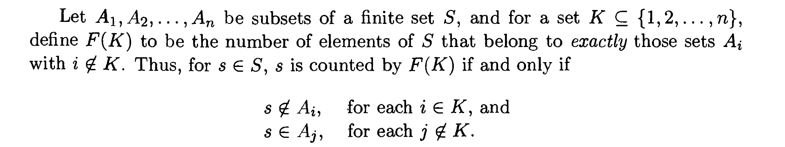

那么
$$
G(K)=\left|\bigcap_{i\notin K} A_i\right|
$$
因为我们考虑$\forall x\in \bigcap_{i\notin K} A_i$

被计数,只需要将所有包含他的$i\in K $的$A_i$移除即可,且只可能一次.

那么我们取$K=\{1,2,\cdots,n\}$

此时$F(K)=|\overline{A_1}\cap \overline{A_2} \cap \cdots \cap \overline{A_n}|$

故得到
$$
|\overline{A_1}\cap \overline{A_2} \cap \cdots \cap \overline{A_n}|=\sum_{J\subseteq K} (-1)^{|J|} \left|\bigcap_{i\in J}A_i \right|
$$

### 三种特殊函数$\left((X,\leq)\right)$

:$X\times X \rightarrow R$

#### 卷积公式

$h=f*g$
$$
h(x,y)=\begin{cases} \sum_{z:x\leq z\leq y} f(x,z)g(z,y) \qquad&,x\leq y\\ 0\qquad &,other\end{cases}
$$


#### 科罗内尔delta函数

$$
\delta(x,y)=\begin{cases}1\qquad ,x=y\\ 0\qquad,other\end{cases}
$$

有$f*\delta=\delta*f=f$

#### $\zeta$函数

$$
\zeta(x,y)=\begin{cases}1\qquad,x\leq y\\ 0\qquad,other\end{cases}
$$

对于$X$中所有的$y$满足$f(y,y)\neq 0$,有其逆函数

#### 逆函数

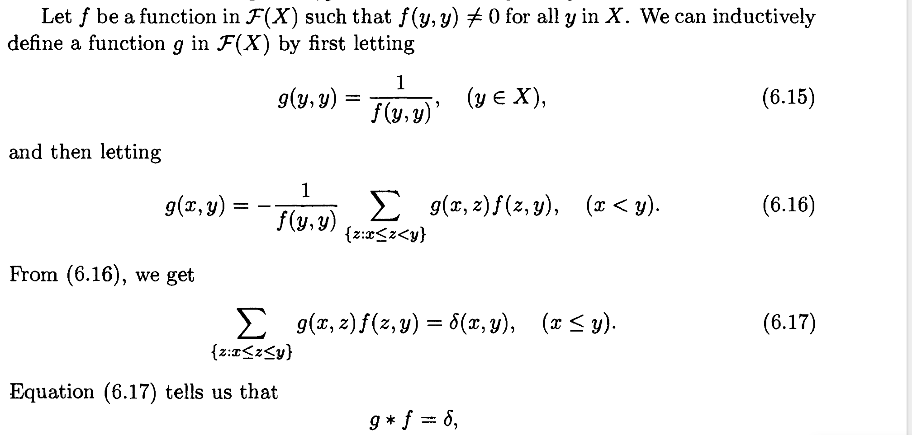

对于(6.16)到(6.17)

有
$$
0=g(x,y)-g(x,y)=-\frac{1}{f(y,y)}\left(g(x,y)f(y,y)+\sum_{x\leq z<y } g(x,z) f(z,y) \right)
$$
对于满足$f(y,y)\neq 0$ 的函数都有逆函数$g$
$$
f*g=g*f=\delta
$$


#### 莫比乌斯函数

$\zeta$函数的逆函数

那么有
$$
\sum_{x\leq z \leq y} \mu(x,z)\zeta(z,y)=\delta(x,y)
$$
得出
$$
\mu(x,y)=\begin{cases}
1&\qquad,x=y\\\\
-\sum_\limits{x\leq z<y} \mu(x,z)&\qquad ,x<y
\end{cases}
$$

### 莫比乌斯反演


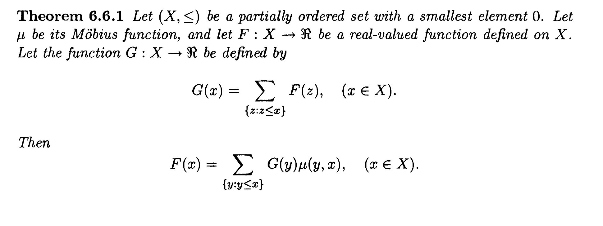

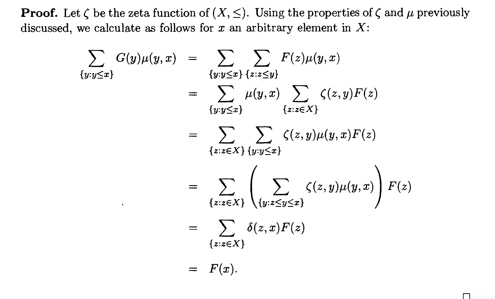

由该定理可以证明本节给出的容斥原理.

### 应用:计算有禁止位置的非攻击型车的方法数

$n\times n$ 棋盘
$$
F(X_n)=\sum_{S\subseteq X_n} (-1)^{n-|S|}\prod_{i=1}^{n}\left(\sum_{j\in S} a_{ij}\right)
$$


其中$S$为$X_n$的子集，$a_{ij}$为棋盘对应的矩阵。

#### 代码

```cpp
int a[30][30];
void solve() {
  int n;
  cin >> n;
  for (int i = 1; i <= n; ++i) {
    for (int j = 1; j <= n; ++j) {
      cin >> a[i][j];
    }
  }
  ll ans = 0;
  for (int i = 0; i < (1ll << n); ++i) {
    vector<int> S;
    // subset S
    for (int j = 0; j < n; ++j) {
      if (i >> j & 1) {
        S.push_back(j + 1);
      }
    }
    ll p = 1;
    for (int k = 1; k <= n; ++k) {
      ll sum = 0;
      for (const auto& x : S) sum += a[k][x];
      p *= sum;
    }
    if ((n - S.size()) & 1) {
      ans -= p;
    } else {
      ans += p;
    }
  }
  cout << ans;
}
```

时间复杂度$O(n^2\cdot2^n)$

### 直积的莫比乌斯函数

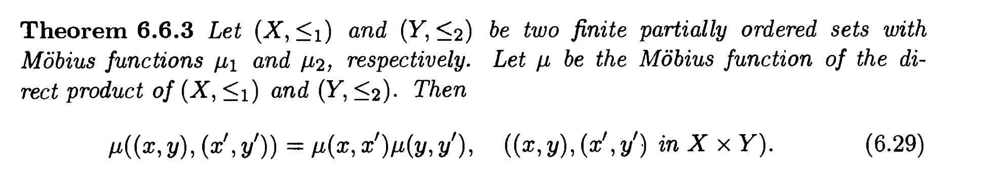

### 常用莫比乌斯函数

#### $(\mathcal{P}(X_n),\subseteq)$

$\mu(A,B)=(-1)^{|B|-|A|}$ 

#### $(X_n,\leq)$

$$
\mu(k,l)=\begin{cases}
1&\qquad,l=k\\
-1&\qquad,l=k+1\\
0&\qquad,other
\end{cases}
$$

#### $(X_n,|)$

$$
\mu(1,n)=\begin{cases}
1&\qquad,n=1\\
(-1)^k&\qquad,n是互不相同的素数乘积\\
0,&\qquad,other
\end{cases}
$$


且有莫比乌斯反演公式
$$
G(n)=\sum_{k|n} F(k)
$$

$$
F(n)=\sum_{k|n}\mu(k,n)G(k)=\sum_{k|n}\mu(1,\frac{n}{k})G(k)
$$


# 递推关系与生成函数

## 斐波拉契数列

### 性质1

$$
\sum_{i=0}^{n} f_i=f_{n+2}-1
$$

### 性质2

$$
2|f_n\iff3|n
$$

## 生成函数

### 牛顿二项式定理

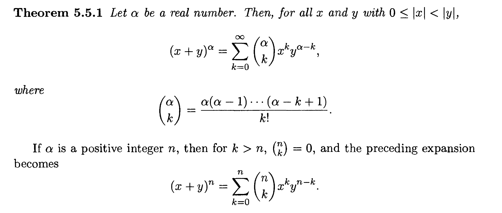

对于$|z|<1$
$$
(1+z)^{\alpha}=\sum_{k=0}^{\infty} \binom{\alpha}{k}z^k
$$
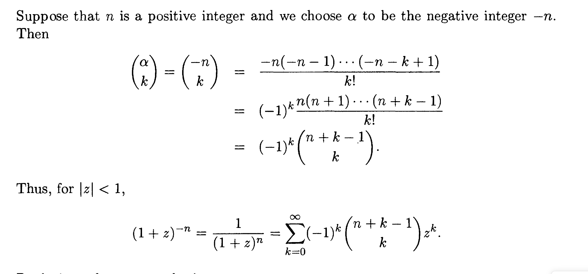


### 一般生成函数

根据泰勒级数
$$
\frac{1}{1-x}=\sum_{n=0}^{\infty}x^n
$$
我们可以解$h_n$表示
$$
e_1+e_2+\cdots+e_k=n
$$
的非负整数解的个数。

其生成函数为
$$
g(x)=\frac{1}{(1-x)^k}
$$


同时类似的数列，可以给因子附加限制求解生成函数。

具体的，对于$l\leq e_i \leq r$其因子为
$$
x^l+x^{l+1}+\cdots + x^{r}
$$
若其有系数$k$，为
$$
1+x^k+x^{2k}+\cdots
$$
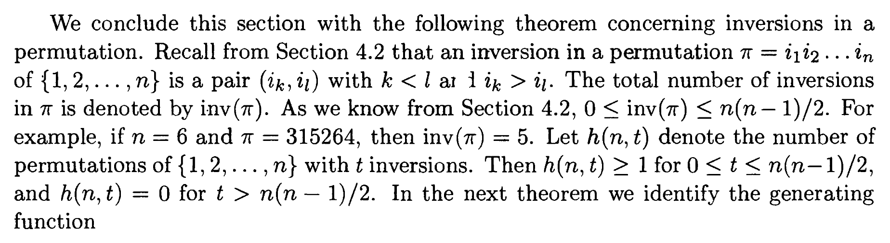

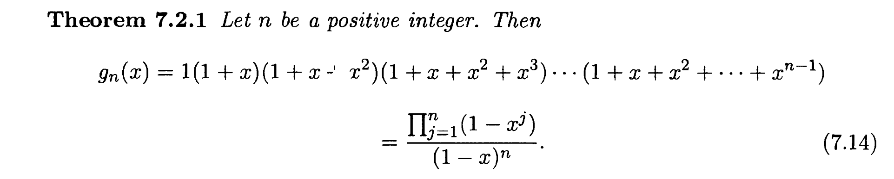

考虑逆序列唯一对应排序。

### 指数生成函数

形如


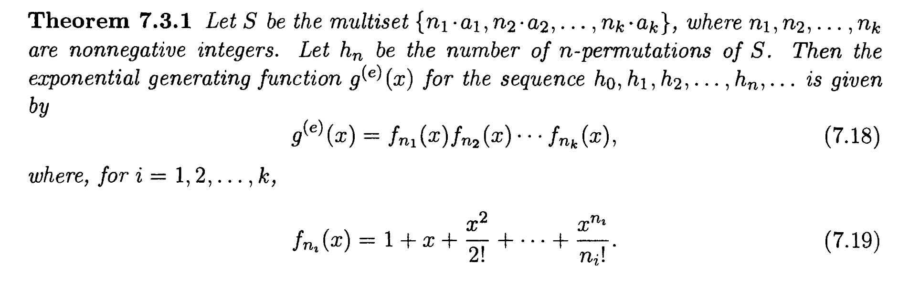

对无限多也成立。

## 线性齐次递推关系

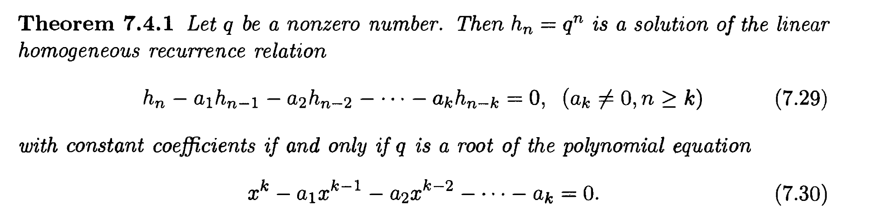

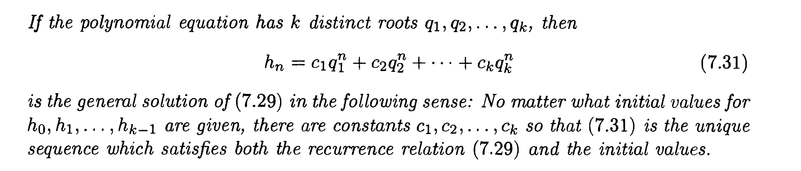

由范德蒙德矩阵可得，只有$q_i$不相等才有解。

### 利用生成函数解线性其次递推关系

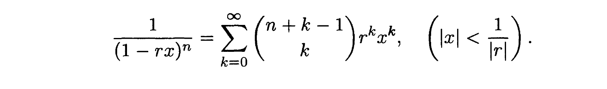

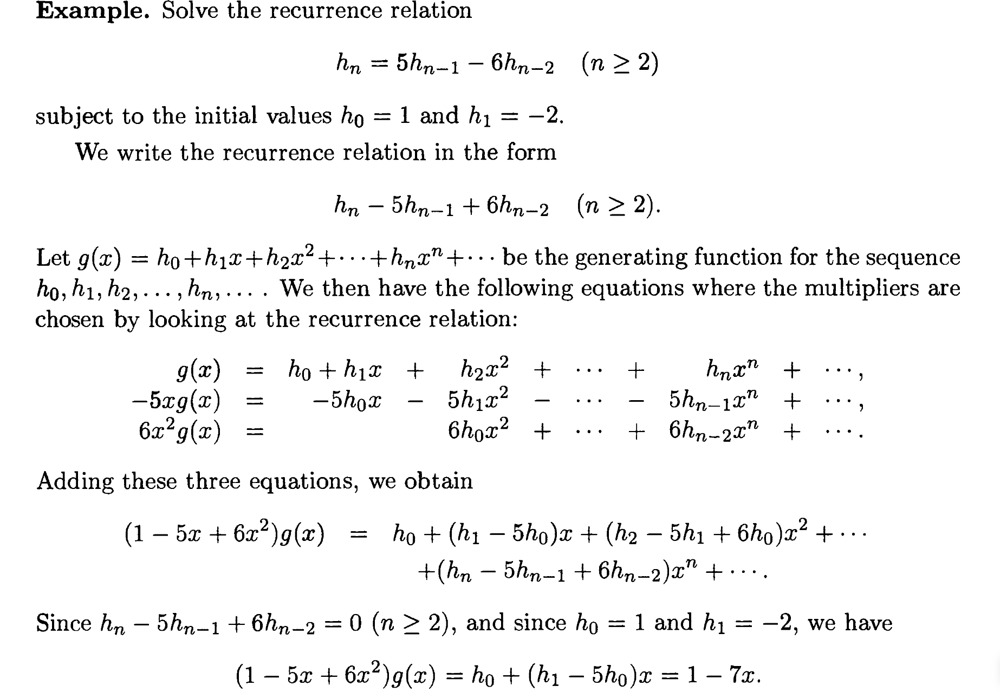

有重根的情况，有定理：
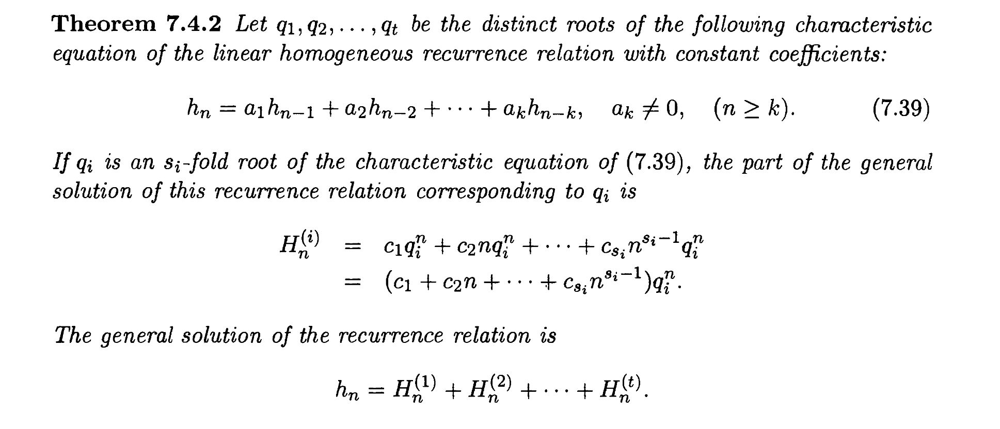

### 非齐次递推关系

求特解

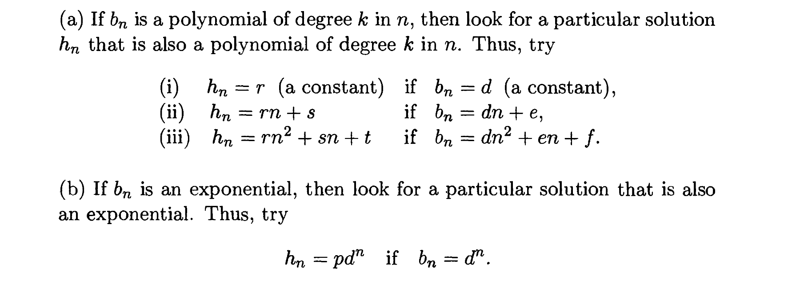

