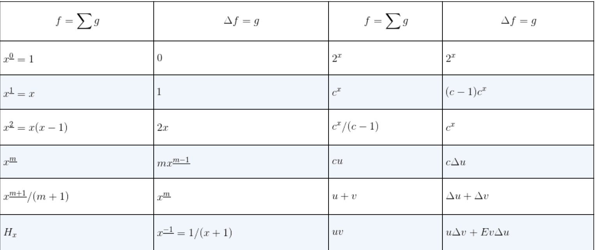

# 具体数学(1&2)

一些记号

**调和数（harmonic numbe）**
$$
H_n=\sum_{k=1}^{n} \frac{1}{k}
$$

基本公式
$$
(x+y)^n=\sum_{k=0}^{n}\binom{n}{k}x^{n-k}y^{k}
$$

$$
a^n-b^n=(a-b)\sum_{1 \le k\le n} a^{n-k}b^{k-1}
$$

## 第一章 递归问题　RECURRENT PROBLEMS

### repertoire method

例
$$
\begin{aligned}
f(1)&=\alpha\\
f(2n)&=2f(n)+\beta\\
f(2n+1)&=2f(n)+\gamma
\end{aligned}
$$
知
$$
f(n)=A(n)\alpha+B(n)\beta+C(n)\gamma
$$
通过对$f(n)$赋值或$(\alpha,\beta,\gamma)$赋值，求解。

### 约瑟夫问题

形如
$$
\begin{aligned}
f(j)&=\alpha_j,\qquad &&1\le j<d\\
f(dn+j)&=cf(n)+\beta_j,\qquad  &&0\le j<d,n\ge 1
\end{aligned}
$$
有
$$
f((b_mb_{m-1}...b_0)_d)=(\alpha_{b_m}\beta_{b_{m-1}}...\beta_{b_0})_c
$$

### 思考

repertoire method：

在参数较少的情况下，可以将一些相同参数，分别设为独立参数，更容易找到有解的情况。

## 第二章 和式 SUMS 

用
$$
\sum_{P(k)} a_k
$$
表示。

### 和式和递归式 SUMS AND RECURRENCES 

**和式可以表示为递归形式：**
$$
\begin{aligned}
&S_0=a_0\\
&S_{n+1}=S_{n}+a_{n+1}
\end{aligned}
$$
用**repertoire method**解。

计算
$$
\sum_{k=0}^{n}(a+bn)
$$
写成递归式
$$
\begin{aligned}
&S_0=\alpha\\
&S_n=S_{n-1}+\beta n+\gamma
\end{aligned}
$$
其中
$$
\alpha=\gamma=a,\beta =b
$$
设
$$
S_n=A(n) \alpha +B(n) \beta+C(n) \gamma
$$
带入$1,n,n^2$

解出
$$
\begin{cases}
&A(n)=1\\
&B(n)=\frac{n(n+1)}{2}\\
&C(n)=n
\end{cases}
$$
故
$$
S_n=a+na+\frac{n(n+1)}{2}b
$$
**递归式可以转化为和式**

对于形如
$$
a_nT_n=b_nT_{n-1}+c_n
$$
的递归式，可以设**求和因子（summation factor）**
$$
s_n=\frac{\prod\limits_{i=1}^{n}a_i}{\prod\limits_{i=1}^{n}b_i}\cdot\frac{b_1}{a_n}
$$
然后同时乘上**求和因子**即可得出
$$
T_n=\frac{1}{s_na_n}\left(s_0a_0T_0+\sum_{k=1}^{n}c_ks_k \right)
$$
**注意：** **求和因子不能为0**

### 和式的处理 MANIPULATION OF SUMS 

**和式的变换**
$$
\begin{aligned}
&\sum_{k\in K}c a_k=c\sum_{k\in K}a_k\\
&\sum_{k\in K}(a_k+b_k)=\sum_{k \in K}a_k +\sum_{k \in K}b_k\\
&\sum_{k\in K} a_k =\sum_{p(k) \in K} a_{p(k)}\\
&\sum_{k\in K }a_k +\sum_{k\in K'} a_k=\sum_{k\in K\cap K'}a_k + \sum_{k\in K\cup K'} a_k
\end{aligned}
$$
其中对于$n\in K$，有且仅有一个整数满足$p(k)=n$

#### 扰动法 （perturbation method）

对一个和式记其为$S_n$，将其第一项和最后一项分离出来，用两种方法改写$S_{n+1}$。

类似于**算两次**法

如求和式
$$
S_n=\sum_{0\le k \le n} k2^k
$$
有
$$
\begin{aligned}
S_n+(n+1)2^{n+1}&=S_{n+1}\\
&=\sum_{0 \le k \le n}(k+1)2^{k+1}\\
&=2S_n+\sum_{0\le k \le n} 2^{k+1}
\end{aligned}
$$
有
$$
\begin{aligned}
S_n&=(n+1)2^{n+1}-\sum_{0 \le k \le n} 2^{k+1}\\
&=(n+1)2^{n+1}-\frac{2(1-2^{n+1})}{1-2}\\
&=(n-1)2^{n+1}+2
\end{aligned}
$$

### 多重和式 MULTIPLE SUMS 

基本性质
$$
\sum_j\sum_ka_{j,k}[P(j,k)]=\sum_{P(j,k)}a_{j,k}=\sum_{k}\sum_ja_{j,k}[P(j,k)]
$$

$$
\sum_{j\in J}\sum_{k\in K(j)} a_{j,k} =\sum_{k\in K'}\sum_{j\in J'(k)} a_{j,k}
$$

$$
\sum_{j\in J}a_{f(j)}=\sum_{j\in J,k\in K} a_k[f(j)=k]=\sum_{k\in K} a_k \sum_{j\in J} [f(j)=k]
$$

其中$f: J\rightarrow K$

**例题：**

求
$$
S_n=\sum_{1\le j <k\le n}\frac{1}{k-j}
$$
有
$$
\begin{aligned}
S_n&=\sum_{1\le k \le n} \sum_{1\le j<k}\frac{1}{k-j}\\
&=\sum_{1\le k \le n} \sum_{0<j\le k-1}\frac{1}{j}\\
&=\sum_{1\le k \le n} H_{k-1}
\end{aligned}
$$
不太好做，（可以交换求和次序解 ）

考虑直接把$k-j$当成一个整体。
$$
\begin{aligned}
S_n&=\sum_{1\le j<k+j\le n}\frac{1}{k}\\
&=\sum_{1\le k \le n}\sum_{1\le j\le n-k} \frac{1}{k}\\
&=\sum_{1\le k \le n} \frac{n-k}{k}\\
&=nH_{n}-n
\end{aligned}
$$
有
$$
\sum_{0\le k <n} H_k=nH_{n}-n
$$
思考：

对含$k+f(j)$的二重和式，可以考虑用$k-f(j)$替换$k$，并先对$j$求和比较好。

几何观点： 按对角线求和。

### 一般性的方法 GENERAL METHODS 

以
$$
S_n=\sum_{0\le k \le n} k^2
$$
为例

#### 归纳法

如果注意到
$$
S_n=\frac{n(n+\frac{1}{2})(n+1)}{3}
$$
就可以使用数学归纳法

#### 扰动法

观察
$$
\begin{aligned}
\sum_{0\le k \le n} k^2+(n+1)^2&=S_{n+1}\\
&=\sum_{1 \le  k\le n+1} k^2\\
&=\sum_{0 \le k \le n}(k+1)^2\\
&=\sum_{0\le k \le n} k^2+2\sum_{0\le k \le n} k+n+1
\end{aligned}
$$
虽然没有成功，但注意到我们，成功地解出了
$$
\sum_{0 \le k \le n} k
$$
考虑对
$$
T_n=\sum_{0 \le k \le n} k^3
$$
操作，有
$$
\begin{aligned}
T_n+(n+1)^3&=T_{n+1}\\
&=\sum_{1 \le k \le n+1} k^3\\
&=\sum_{0 \le k \le n} (k+1)^3\\
&=T_n+3S_n+3\sum_{0 \le k \le n}k+n+1
\end{aligned}
$$
得到
$$
\begin{aligned}
3S_n&=(n+1)^3-3\frac{n(n+1)}{2}-(n+1)\\
&=(n+1)\left(n^2+\frac{1}{2}n\right)\\
&=n(n+\frac{1}{2})(n+1)
\end{aligned}
$$

#### 成套方法

有
$$
\begin{aligned}
&R_0=d\\
&R_n=R_{n-1}+an^2+bn+c
\end{aligned}
$$
其解的一般形式为
$$
R_n=aA(n)+bB(n)+cC(n)+dD(n)
$$
设$R_n=1,n,n^2,n^3$

解得
$$
\begin{cases}
A(n)=\frac{n(n+\frac{1}{2})(n+1)}{3}\\
B(n)=\frac{1}{2}(n^2+n)\\
C(n)=n\\
D(n)=1
\end{cases}
$$
故
$$
R_n=A(n)
$$
事实上对(a,b,c,d)赋值更简单。

#### 微积分法

求
$$
\begin{aligned}
S_n-\int_0^nx^2 dx&=\sum_{1 \le k \le n}\left(k^2-\int_{k-1}^{k} x^2dx \right)\\
&=\sum_{1\le k \le n}(k-\frac{1}{3})\\
&=\frac{n(n+1)}{2}+\frac{n}{3}
\end{aligned}
$$

#### 展开和收缩

转化为二重和式，以简化通项。
$$
\begin{aligned}
S_n&=\sum_{1 \le k \le n} k^2\\
&=\sum_{1 \le k \le n}k \sum_{1\le j \le k}1 \\
&=\sum_{1 \le j \le n} \sum_{j\le k \le n} k\\
&=\sum_{1 \le j \le n} \frac{(j+n)(n-j+1)}{2}\\
&=\frac{n^3+n^2}{2}+\frac{1}{2}\frac{n(n+1)}{2}- \frac{1}{2} S_n
\end{aligned}
$$

#### 有限微积分

有$k^2=k^{\underline{2}}+k^{\underline{1}}$

故
$$
\begin{aligned}  
\sum_{0 \le k \le n} k^2 &= \sum_{0 \le k < n+1} k^{\underline{2}} + k^{\underline{1}} \\
&= \left. \left( \frac{k^{\underline{3}}}{3} + \frac{k^{\underline{2}}}{2} \right) \right|_{0}^{n+1} \\
&= \left( \frac{(n+1)^{\underline{3}}}{3} + \frac{(n+1)^{\underline{2}}}{2} \right) \\
&= \frac{(n+1)(n+\frac{1}{2})n}{3}.  
\end{aligned}
$$

### 有限微积分

类似**微分算子**$D$
$$
D f(x)=\lim\limits_{h\rightarrow 0}\frac{f(x+h)-f(x)}{h}
$$
定义**差分算子**$\Delta$
$$
\Delta f(x)= f(x+1)-f(x)
$$
定义**下降阶乘幂 （falling factorial power）**
$$
x^{\underline{m}}=x(x-1)\cdots(x-m+1)\qquad (m\ge 0 \in Z)
$$
和**上升阶乘幂 （rising factorial power）**
$$
x^{\overline{m}}=x(x+1)\cdots(x+m-1)\qquad (m\ge 0 \in Z)
$$
注意到：$n!=n^{\underline{n}}=1^{\overline{n}}$

有
$$
\Delta(x^{\underline{m}})=mx^{\underline{m-1}}
$$
类比积分，我们定义**不定和式 （indefinite sum）**
$$
\sum g(x)\delta x
$$
满足
$$
g(x)=\Delta f(x)\iff \sum g(x)\delta x=f(x)+C
$$
其中$C$为满足$p(x+1)=p(x)$的任意一个函数$p(x)$。

有限微积分有确定的和式 （sum）
$$
\sum_a^b g(x)\delta x=f(x)|_a^b=f(b)-f(a)
$$
**有以下性质**
$$
\begin{aligned}
&\sum_a^b g(x)\delta x= \sum_{a\le k < b} g(x) \qquad a\le b\\
&\sum_a^{b}g(x) \delta x =-\sum_{b}^ag(x)\delta x\\
&\sum_a^b+\sum_b^c=\sum_a^c
\end{aligned}
$$
**并且阶乘幂满足二项式定理**

负指数的下降阶乘幂定义如下
$$
x^{\underline{-m}}= \frac{1}{(x+1)(x+2)\cdots(x+m)} \qquad m>0
$$

从而有以下性质
$$
x^{\underline{m+n}}=x^{\underline{m}}(x-m)^{\underline{n}}
$$

$$
\sum_{a}^{b} x^{\underline{m}}  \delta x=\left. \frac{x^{\underline{m+1}}}{m+1}\right|_a^b, \qquad (m\neq -1)
$$

若$m=-1$ 则为$H_b-H_a$

#### 分部求和 （summation by parts)

有
$$
\Delta(u(x)v(x))=u(x)\Delta v(x)+Ev(x)\Delta u(x)
$$
其中，**E为移位算子 （shift operator）**$Ef(x)=f(x+1)$

简记为
$$
\Delta(uv)=u\Delta v+Ev \Delta u
$$
从而有
$$
\sum u\Delta v=uv-\sum Ev\Delta u
$$
如
$$
\begin{aligned}
\sum_{k=0}^{n}k 2^k&=\sum_{0}^{n+1}x2^x\delta x\\
&=\sum_{0}^{n+1}x\delta 2^x\\
&=(n+1)2^{n+1}-\sum_{0}^{n+1}2^{x+1}\delta x\\
&=(n+1)2^{n+1}-2^{n+2}+2\\
&=(n-1)2^{n+1}+2
\end{aligned}
$$

$$
\begin{aligned}
\sum_{0\le k< n} k H_k&=\sum_{0}^{n} xH_x \delta x\\
&=\frac{1}{2}\left( \sum_0^n H_x\delta x^{\underline{2}}  \right)\\
&=\frac{1}{2}\left( x^{\underline{2}} H_n- \sum_0^n x \delta x  \right)\\
&=\frac{1}{2}\left( x^{\underline{2}} H_n- \frac{n^{\underline{2}}}{2}  \right)\\
&=\frac{n^{\underline{2}}}{2} \left(H_n-\frac{1}{2} \right)
\end{aligned}
$$

### 无限和式 INFINITE SUMS 

先复习一下微积分中级数的知识。

---

**几何级数**
$$
\sum_{n=1}^{\infty} aq^{n-1}\begin{cases}
发散& |q|\geq1\\
收敛& otherwise
\end{cases}
$$

**p级数(p>0)**
$$
\sum_{n=1}^{\infty}\frac{1}{n^p}\begin{cases}
发散& p\leq1\\
收敛& otherwise
\end{cases}
$$

#### 判别发散

1. $\lim_{n \rightarrow \infty}a_n\neq0$或不存在

2. 添加括号,和改变

#### 正项级数审敛法

##### 比较判别法(极限形式)

设$\lim_{n\rightarrow \infty}\frac{a_n}{b_n}=k$.

+ $0<k<+\infty$ ,同时发散或收敛
+ $k=0$,若$b_n$收敛,则$a_n$收敛
+ $k=+\infty$,若$b_n$发散,则$a_n$发散

##### 比值判别法(极限形式)

设$\lim_{n\rightarrow \infty}\frac{a_{n+1}}{a_n}=q$

+ 当$0\leq q<1$,收敛
+ $q>1$,f发散

##### 根值审敛法(极限形式)

设$\lim_{n\rightarrow\infty}\sqrt[n]{a_n}=q$

+ 当$0\leq q<1$,收敛
+ $q>1$,f发散

#### 交错级数审敛法

##### 发散

由比值和根值审敛法,判断绝对值发散,则发散.

##### 绝对收敛

如果级数$\sum_{n=1}^{\infty}|a_n|$收敛则$\sum_{n=1}^{\infty}a_n$也收敛

##### 莱布尼茨定理

交错级数$\sum_{n=1}^{\infty}(-1)^{n-1}a_n$,满足

+ $\lim_{n\rightarrow \infty}a_n=0$
+ $a_{n+1}\leq a_n$

则级数收敛

#### 幂级数

形如
$$
\sum_{n=0}^{\infty}a_n(x-x_0)^n
$$

##### 收敛性

1. 形如$\sum_{n=0}^{\infty}a_nx^n$​有
   $$
   \sum_{n=0}^{\infty}a_nx^n的收敛半径=\lim_{n\rightarrow \infty}\left|\frac{a_n}{a_{n+1}} \right|
   $$

2. 缺项,利用比值审敛法

3. 形如$\sum_{n=0}^{\infty}a_n(x-x_0)^n$整体代换

##### 和函数

$s(x)$
$$
\sum_{n=0}^{\infty}a_nx^n
$$

1. 和函数在收敛域连续

2. $$
   \int_0^xs(t)dt=\int_0^x\left(\sum_{n=0}^{\infty}a_nt^n \right)dt=\sum_{n=0}^{\infty}\left(\int_0^xa_nt^ndt\right)
   $$

3. $$
   s'(t)=\left(\sum_{n=0}^{\infty}a_nx^n \right)'=\sum_{n=0}^{\infty}\left(a_nx^n\right)'
   $$

##### 函数展开成幂级数

在$x_0$处
$$
f(x)=\sum_{n=0}^{\infty}\frac{f^{(n)}(x_0)}{n!}(x-x_0)^n
$$
称为**泰勒级数**

当$x_0=0$时
$$
f(x)=\sum_{n=0}^{\infty}\frac{f^{(n)}(0)}{n!}x^n
$$
称为**麦克劳林级数**

###### 间接展开法

利用公式
$$
\begin{align*}
e^x&=\sum_{n=0}^{\infty}\frac{x^n}{n!} \qquad& x\in(-\infty,+\infty)\\
\sin x&=\sum_{n=0}^{\infty}(-1)^n\frac{x^{2n+1}}{(2n+1)!} \qquad& x\in(-\infty,+\infty)\\
\cos x&=\sum_{n=0}^{\infty}(-1)^n\frac{x^{2n}}{(2n)!} \qquad& x\in(-\infty+-\infty)\\
\frac{1}{x+1}&=\sum_{n=0}^{\infty}(-1)^nx^n \qquad& x\in(-1,1)\\
\ln{(x+1)}&=\sum_{n=0}^{\infty}(-1)^n\frac{x^{n+1}}{n+1}\qquad&x\in(-1,1]
\end{align*}
$$

---

#### 回归正题

以上内容仅供**参考**，与这本书的内容并**没太大关系**。

回到这本书。

容易发现
$$
\sum_{k\ge0} x^k=
\begin{cases}
\frac{1}{1-x},& 0\le x<1\\
\infty ,& x\ge1
\end{cases}
$$
**交错和**
$$
\sum_{k\in K}a_k =\sum_{k\in K}a_k^{+}-\sum_{k\in K} a_k^{-}
$$
设$A^{+}=\sum_{k\in K}a_k^{+} $，类似定义$A^{-}$

+ 若均有限的值，则称为**绝对收敛。**
+ 若$A^{+}=\infty$，而后者为有限的值，则称发散于$+\infty$，反之发散于$-\infty$
+ 否则不做定义。

**只要我们处理的是刚才所定义的绝对收敛的和式，这一章里的所有操作都完全成立． **

对复数分实部和虚部计算即可。

## 第一章部分习题解答

## 第二章部分习题解答
