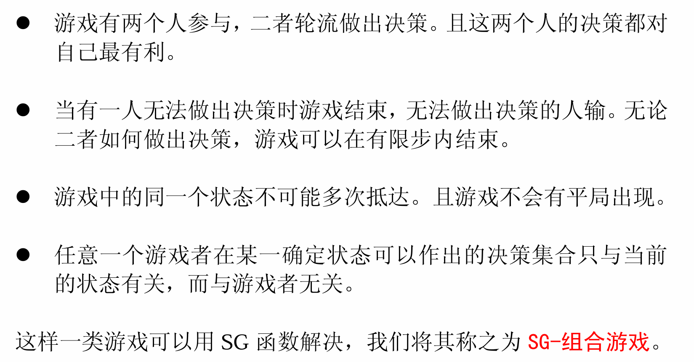

# 博弈论题单

> 大多数题不做证明,因为证明一般很简单

## [Northcott Game](https://acm.hdu.edu.cn/showproblem.php?pid=1730)(**非公平组合游戏**)

注意到**不能直接用sg函数打表**,因为这是**非公平组合游戏**

公平组合游戏

- 两人游戏。
- 两人轮流走步。
- 有一个状态集，而且通常是有限的。
- 有一个终止状态，到达终止状态后游戏结束。
- 游戏可以在有限的步数内结束。
- 规定好了哪些状态转移是合法的。
- 所有规定对于两人是一样的。



显然两人移动的棋子不一样,换句话说,**显然会有一方处于优(劣)势**,

我们首先肯定需要找到优势和劣势的情况,

比较显然的是**相邻先手劣势,不相邻先手优势**,

考虑一下几个思路,现在就需要整体考虑

先推理一下性质,

P: 全部相邻

N:有一个不相邻,

### 打表

为了打表,需要简化操作,对于一个相邻的子游戏,我们没有必要去动它,不影响结果

对于不相邻的两个,没有必要去远离,因为不影响结果,因此就成了去接近的问题.

这就是Nim游戏,没必要打表了.......

### 直接处理

若有两个不相邻,容易想到若两个长度相同,后手只需要重复先手的操作即可.->每一种长度是偶数个显然先手必败,若有一个长度的个数为奇数先手就必胜,异或即可.这里发现已经转化成为**Nim游戏**

### 转化

同上

## [Conquer the Multiples](https://qoj.ac/contest/1913/problem/9039)(**SG**)

不妨先定r,然后**sg打表**

观察:

首先呈现出取奇数优势,(因为偶数行动的人不能影响奇数,因此奇数而容易取胜).

但有不对的位置

```
3 4 0

5 6 0
5 8 0

7 8 0
7 10 0
7 12 0

9 10 0
9 12 0
9 14 0
9 16 0

11 12 0
11 14 0
11 16 0
11 18 0

13 14 0
13 16 0
13 18 0

15 16 0
15 18 0

17 18 0
```

即奇数位置先手不能取胜的位置,发现**r为偶数**,r为奇数显然是先手必胜的,因为只需要取1倍即可.而偶数若取1倍进行下去是会输掉的,因此要向后取出一个,即$2l\le r$才能赢.下面处理偶数位置,

类似的思想处理l为偶数,若r为奇数,那么一定是后手胜,但如果r是偶数的话需要判断$2(l+1)\le r$

## [Doubloon Game](https://acm.hdu.edu.cn/showproblem.php?pid=4203)(SG)

SG打表找规律,

容易发现的规律

```
// 1.k is odd, s is even, sg=0
// 2.k is odd, s is odd, sg!=0
```

然后容易猜想会存在一个周期,注意找**SG函数的周期!!!!!!**,不要找必败态的周期.

然后容易发现k为偶数,sg函数的周期为k+1.可以存下来做,

进一步

似乎为`1010...10120`,

当为2时,移动k; 为1时移动1即可.

## [The Game of 31](https://acm.hdu.edu.cn/showproblem.php?pid=4155)(搜索)

这一类博弈论,没什么规律,通常数据小,直接dfs,注意剪枝,即考虑记忆化或者提前返回.

```cpp
bool win(int x) {
  if (x>31) return true;
  bool lose=false;
  for (int i=1;i<=6;++i) {
    if (f[i]) {
      f[i]--;
      lose|=(!win(x+i));
      f[i]++;
      if (lose) return lose;//剪枝
    }
  }
  return lose;
}
```

## [P10152 「LAOI-5」拼图](https://www.luogu.com.cn/problem/P10152)(Ad-hoc)

