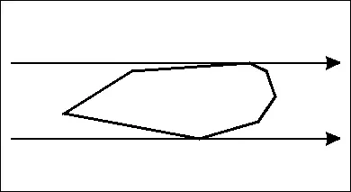

# **萝莉控都能看懂的二维凸包**（Convex Hull）

## 定义

平面上给定若干点，则它们的凸包被定义为所有能包含所有点的**凸多边形**的**交集**。

其**面积和周长**都是最小的。

## 静态凸包（Andrew算法）

首先我们需要先找到一种连接方式使得没有交叉的边。然后消除凹的部分。

具体的我们直接以横坐标为第一关键词、纵坐标为第二关键词排序，连接相邻的点。

维护一个栈，按顺序加点，判断栈顶的3个点，是凹的就将栈顶出栈，直到没有3个点或者是凸的。

再逆序做一次即可。注意第一个点被加了2次。

```cpp
template <class T>
vector<Point<T>> staticConvexHull(vector<Point<T>> A, int flag = 1) {
  int n = A.size();
  if (n <= 2) {  // 特判
    return A;
  }
  vector<Point<T>> ans(n * 2);
  sort(A.begin(), A.end());
  int now = -1; 	
  for (int i = 0; i < n; i++) {  // 维护上凸包
    while (now > 0 && cross(A[i], ans[now], ans[now - 1]) <= 0) {
      now--;
    }
    ans[++now] = A[i];
  }
  int pre = now;
  for (int i = n - 2; i >= 0; i--) {  // 维护下凸包
    while (now > pre && cross(A[i], ans[now], ans[now - 1]) <= 0) {
      now--;
    }
    ans[++now] = A[i];
  }
  ans.resize(now);
  return ans;
}
```

由于上下凸包是唯一的。所以可以从一个方向维护凸包。

## 练习

### [P2742 [USACO5.1] 圈奶牛Fencing the Cows /【模板】二维凸包](https://www.luogu.com.cn/problem/P2742)

### [P3194 [HNOI2008] 水平可见直线](https://www.luogu.com.cn/problem/P3194)

最终结果一定是一系列斜率递增的直线围成的凸多边形，

对于3条直线$L_1=A_1x+B_1;L_2=A_2x+B_2;L_3=A_3x+B_3$

斜率递增，那么第2条直线被完全覆盖的当且仅当$L_1,L_3$的交点在$L_2$上面。化简一下有
$$
\frac{B_3-B_1}{A_3-A_1}\ge\frac{B_2-B_1}{A_2-A_1}
$$
不难发现就是求上凸包。

### [Highway Upgrade](https://ac.nowcoder.com/acm/contest/108299/H)（一堆直线求任意x取值的最值）

对于3条直线$L_1=A_1x+B_1;L_2=A_2x+B_2;L_3=A_3x+B_3$

斜率递增，那么第2条直线被完全覆盖的当且仅当$L_1,L_3$的交点在$L_2$下面。化简一下有
$$
\frac{B_3-B_1}{A_3-A_1}\le\frac{B_2-B_1}{A_2-A_1}
$$
不难发现就是将直线的两个参数变成点然后求下凸包。

或者

$L_1,L_2,L_3$斜率递增

我们有$L_3$分别与$L_1,L_2$交于$x_1,x_2$,若$x_1\le x_2$则$L_2$被覆盖。有
$$
\frac{B_1-B_3}{A_3-A_1}\le \frac{B_2-B_3}{A_3-A_2}\iff \frac{B_3-B_1}{A_3-A_1}\ge\frac{B_3-B_2}{A_3-A_2}
$$
同样等价于求下凸包。

### [P3299 [SDOI2013] 保护出题人](https://www.luogu.com.cn/problem/P3299)（斜率优化）

问题可变成：给定平面一点集。Q次询问，每次求出斜率最大值。

对于凸多边形外部一点，斜率最值是在顶点取得的，并且从最小值按逆时针方式斜率先增大后减小。

### [P2924 [USACO08DEC] Largest Fence G](https://www.luogu.com.cn/problem/P2924)（dp）

处理出所有边（带方向），极角排序后dp。

具体地，我们确定起始点后，定义$dp_i$为以i点结尾的答案，然后枚举每一条边，因为排了序，那么最后闭合的曲线一定是凸的，我们可以倒退回去，显然中间的点也并不会错误更新。

## 旋转卡壳

求出了凸包，我们希望维护一些性质，如**凸多边形的直径**。这个时候可以利用旋转卡壳来做。



先补充一些概念：

+ 凸多边形的切线（supporting lines）：如果一条直线与凸多边形有交点，并且整个凸多边形都在这条直线的一侧，那么这条直线就是该凸多边形的一条切线。
+ 对踵点（antipodal pair）：如果过凸多边形上两点作一对平行线，使得整个多边形都在这两条线之间，那么这两个点被称为一对对踵点。可以证明凸n边形的对踵点数是$O(n)$的。
+ 凸多边形的直径：即凸多边形上任意两个点之间距离的最大值。直径一定会**在对踵点中产生**

算法：通过枚举边，然后利用叉乘找离边最远的点，逆时针选择，显然点也会跟着转，利用双指针维护即可做到$O(n)$。

这里给出**求凸包上的点能构成的最大四边形的面积**的模板

```cpp
template<class T> T rotatingCalipers(vector<Point<T>> &p) {
  auto S=[&](int x,int y,int z) {
    return abs(cross<ld>(p[x], p[y], p[z]))/2.L;
  };
  int n = p.size();
  T ans = 0;
  auto nxt = [&](int i) -> int {
    return i == n - 1 ? 0 : i + 1;
  };
  for (int i = 0; i < n; i++) {
    int p1 = nxt(i), p2 = nxt(nxt(nxt(i)));
    for (int j = nxt(nxt(i)); nxt(j) != i; j = nxt(j)) {
      while (nxt(p1) != j && S(i, j, nxt(p1)) > S(i, j, p1)) {
        p1 = nxt(p1);
      }
      if (p2 == j) {
        p2 = nxt(p2);
      }
      while (nxt(p2) != i && S(i, j, nxt(p2)) > S(i, j, p2)) {
        p2 = nxt(p2);
      }
      ans = max(ans, S(i, j, p1) + S(i, j, p2));
    }
  }
  return ans;
}
```


根据 Günter Rote 于 2019 年发表的论文 “[The Largest Contained Quadrilateral and the Smallest Enclosing Parallelogram of a Convex Polygon](https://page.mi.fu-berlin.de/rote/Papers/pdf/The%2Blargest%2Bcontained%2Bquadrilateral%2Band%2Bthe%2Bsmallest%2Benclosing%2Bparallelogram%2Bof%2Ba%2Bconvex%2Bpolygon.pdf?utm_source=chatgpt.com)” 可以将时间复杂度降到$O(n)$

称四边形“与方向 $u$ 锚定”：

+ 对于内含四边形，要求其一条对角线 $AC$ 平行于 $u$。

+ 对于外包平行四边形，同样令一个对边对组平行于 $u$。

论文证明：**只需在所有与凸多边形某条边方向锚定的候选中寻找最优解**。

**定义1**：**D-锚定四边形** ABCD 是指其对角线 AC 与方向 u 平行；**S-锚定平行四边形** abcd 是指其一对对边（b和d）与 u 平行。

若四边形 F=ABCD 和平行四边形 G=abcd 构成共轭对，则 AC 与 G 的两条平行边 b,d 共线，并且 F （四边形）的每个顶点落在 G（平行四边形） 的对应边上（ each corner A, B, C, D of F lies on the corresponding side a, b, c, d of G）。


灰色区域 F=ABCD 为D-锚定于 u 的内接四边形，黑色框 G=abcd 为S-锚定于同向 u 的外包平行四边形；且若它们构成共轭对，则 F 的每个顶点恰好落在 G 的对应边上。

**Lemma1：**

+ Let G be a parallelogram, S-anchored to some direction u. Then a quadrilateral F that is contained in G and is D-anchored to u is a largest quadrilateral with these properties if and only if (F, G) is a conjugate pair。
+  Let F be a quadrilateral, D-anchored to some direction u. Then a parallelogram G that contains F and is S-anchored to u is a smallest parallelogram with these properties if and only if (F, G) is a conjugate pair。
+  If (F, G) is a conjugate pair, the area of G is twice the area of F

**Lemma 2：**（最优性的共轭对表征）

Let P be a convex polygon in the plane, and let u be a direction.

+ A quadrilateral F that is D-anchored to u and contained in P is a largest quadrilateral with these properties if and only if there is a parallelogram containing P that is conjugate to F.
+ A parallelogram G enclosing P and S-anchored to u is a smallest parallelogram with these properties if and only if there is a quadrilateral contained in P that is conjugate to G.

**在凸多边形 P 中，任意最大D-锚定四边形 F 和最小S-锚定平行四边形 G 之间也必然构成共轭对。**

考虑旋转卡壳的过程，将会有一个点在某条边上移动，计算面积容易得到，**那条平行边一定是在对踵点处取得。**


在固定方向 $u(\theta)$ 的情况下，论文用旋转卡尺先确定一对 $A(\theta)$ 和 $C(\theta)$。此时 $A(\theta)$ 是某条多边形边 $e=V_iV_{i+1}$ 上的锚定点之一（或者恰在顶点 $V_i$ ），而 $C(\theta)$ 则在另一条边 $e'=V_jV_{j+1}$ 上滑动，以保持 $AC\parallel u$。

我们可以在该边 $e'$ 上用参数 $t\in[0,1]$ 表示 $C(t)= (1-t)\,V_j + t\,V_{j+1}$。随着方向 $\theta$ 在对应的角度区间内变化，卡尺不断驱动 $C$ 沿 $e'$ 线性滑动，对应 $t$ 单调增加或减少，但始终满足 $A\,C(t)\parallel u(\theta)$ 这一约束。

将内接四边形视作由两部分三角形拼接：
$$
F(\theta)\;=\;A(\theta)\;B(\theta)\;C(\theta)\;D(\theta)
\;\;=\;\triangle A B C \;\cup\;\triangle A C D.
$$
固定其余三点 $A,B,D$ 与方向 $u$，仅让 $C=C(t)$ 沿边 $V_jV_{j+1}$ 移动。用行列式（叉积）计算有向面积，可得
$$
\begin{aligned}
\text{Area}(F) 
&= \tfrac12\Bigl|\det(B - A,\;C(t)-A)\Bigr|
  + \tfrac12\Bigl|\det(C(t)-A,\;D - A)\Bigr| \\
&= \tfrac12\Bigl|\det\bigl(B - A,\;(1-t)(V_j-A)+t(V_{j+1}-A)\bigr)\Bigr|
  + \tfrac12\Bigl|\det\bigl((1-t)(V_j-A)+t(V_{j+1}-A),\;D-A\bigr)\Bigr|.
\end{aligned}
$$
由于行列式关于其每个向量参数都是线性的，上式对 $t$ 可展开为
$$
\text{Area}(F)\;=\;\alpha\,t\;+\;\beta,
$$
其中
$$
\alpha \;=\;\tfrac12\Bigl(\det(B - A,\;V_{j+1}-V_j)\;+\;\det(V_{j+1}-V_j,\;D - A)\Bigr),
$$
$\beta$ 为不含 $t$ 的常数项。也就是说，**当 $C$ 在同一条边上线性滑动时，四边形面积关于参数 $t$ 是一次函数**。

**其极值点显然在端点。**

而对踵点是$O(n)$的。用常规的旋转卡壳已经可以$O(n)$求解了。


我们以找四边形为例子。维护四个指针，$A,C$必然是对踵点，$B,D$也是对踵点。


从(a)的初始状态开始，当一条支撑线撞击边时(A→B变动)，点 A 沿该边滑动(b)；继续旋转直到另一条线撞击(c)(d)，点 C 相应滑动。这一循环直到φ达到 180°，此时 A,C 交换了初始位置，形成了一次完整旋转。可证明，在整个过程中每时刻 A(t),C(t) 都是 P 的对踵点，即我们获得了所有可能方向下的一对对角点(A,C)。

```cpp
template<class T> pair<vector<Point<T>>, T> maxInscribedQuadrilateral(vector<Point<T>>& p) {
  int n = (int)p.size();
  // 至少需要4个顶点
  if (n < 4) return {{}, 0};
  // 计算三角形的双倍面积（绝对值）
  auto area2 = [&](int i, int j, int k) {
    T dx1 = p[j].x - p[i].x;
    T dy1 = p[j].y - p[i].y;
    T dx2 = p[k].x - p[i].x;
    T dy2 = p[k].y - p[i].y;
    return abs(dx1 * dy2 - dy1 * dx2);
  };

  // 找最低且最左顶点 (a0)，最高且最右顶点 (c0)
  int a0 = 0, c0 = 0;
  for (int i = 1; i < n; i++) {
    if (p[i].y < p[a0].y || (p[i].y == p[a0].y && p[i].x < p[a0].x))
      a0 = i;
    if (p[i].y > p[c0].y || (p[i].y == p[c0].y && p[i].x > p[c0].x))
      c0 = i;
  }

  int a = a0, b = a0, c = c0, d = c0;
  T maxArea = 0;
  int bestA = a, bestB = b, bestC = c, bestD = d;

  // 旋转卡尺主循环
  while (true) {
    // 移动 b 指针，使 A-B-C 三角形面积最大
    while (true) {
      int nb = (b + 1) % n;
      if (area2(a, nb, c) > area2(a, b, c)) b = nb;
      else break;
    }
    // 移动 d 指针，使 C-D-A 三角形面积最大
    while (true) {
      int nd = (d + 1) % n;
      if (area2(c, nd, a) > area2(c, d, a)) d = nd;
      else break;
    }
    // 计算四边形面积（注意这里 area2 返回双倍面积）
    T areaQuad = (area2(a, b, c) + area2(a, c, d)) * T(0.5);
    if (areaQuad > maxArea) {
      maxArea = areaQuad;
      bestA = a; bestB = b; bestC = c; bestD = d;
    }
    // 判断旋转方向：比较移动 C 后与移动 A 后的面积
    int a_next = (a + 1) % n;
    int c_next = (c + 1) % n;
    // 如果 area2(a,a_next,c_next) <= area2(a,a_next,c)，则移动 A，否则移动 C
    if (area2(a, a_next, c_next) <= area2(a, a_next, c)) {
      a = a_next;
    } else {
      c = c_next;
    }
    // 退出条件：回到初始对换位置
    if (a == c0 && c == a0) break;
  }
  
  vector<Point<T>> quad = { p[bestA], p[bestB], p[bestC], p[bestD] };
  return {quad, maxArea};
}
```


