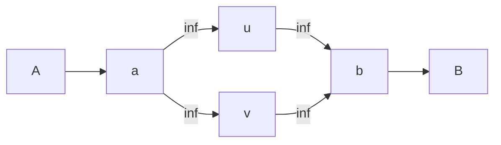

# 网络流学习笔记

> 基本上不解释算法，提供模板，总结建模。

## 基本概念

**网络：**指的是一个带权有向图，并且有一个源点（s）和汇点（t）。

**容量：**边权为这条边的容量$c(u,v)$，若两点间没有边可以认为容量为0。

**流：**是一个边集映射到数集的一个函数，即经过某条边的流量，除源点，汇点外，其他点净流量（流出的流量和减去流入的流量和）为0，对于网络上的流$f$，定义其为s的净流量。

**割：**对于网络$G=(V,E)$，其顶点的划分$\{S,T\}$，若满足$s\in S,t \in T$，称其为$G$的一个割。其容量定义为
$$
\sum_{u \in S} \sum_{v \in T} c(u,v)
$$
所谓割，就是从网络中选择一些边，使得去掉这些边后，剩下两个不连通的分别包含源点和汇点的点集。割的大小是这些边的容量之和。
**增广路**，是从源点到汇点的路径，其上所有边的残余容量均大于0。


## 最大流问题

在网络$G=(V,E)$上指定流$f$，最大化整个网络的流量。或者说假定从源点流出的流量足够多，求能够流入汇点的最大流量。

通过Ford-Fulkerson算法，不断找增广路，就可以找出最大流。正确性和**最大流最小割定理**等价。

具体地：每次正向容量减少，反向容量加上相同的值。

### Dinic 算法

BFS分层+DFS增广

时间复杂度$O(V^2 E)$

```cpp
template<typename T> struct Flow_ {
    const int n;
    const T inf = numeric_limits<T>::max();
    struct Edge {
        int to;
        T w;
        Edge(int to, T w) : to(to), w(w) {}
    };
    vector<Edge> ver;  // 存所有边（正向边 + 反向边）
    vector<vector<int>> h;  // 邻接表，h[u] 存的是 ver 数组中的下标
    vector<int> cur, d;
    Flow_(int n) : n(n + 1), h(n + 1) {}
    void add(int u, int v, T c) {
        h[u].push_back(ver.size());
        ver.emplace_back(v, c);
        h[v].push_back(ver.size());
        ver.emplace_back(u, 0);
    }
    bool bfs(int s, int t) {
        d.assign(n, -1);
        d[s] = 0;
        queue<int> q;
        q.push(s);
        while (!q.empty()) {
            auto x = q.front();
            q.pop();
            for (auto it : h[x]) {
                auto [y, w] = ver[it];
                if (w && d[y] == -1) {
                    d[y] = d[x] + 1;
                    if (y == t) return true;
                    q.push(y);
                }
            }
        }
        return false;
    }
    T dfs(int u, int t, T f) {
        if (u == t) return f;
        auto r = f;
        for (int &i = cur[u]; i < h[u].size(); i++) {
            auto j = h[u][i];
            auto &[v, c] = ver[j];
            auto &[u, rc] = ver[j ^ 1];
            if (c && d[v] == d[u] + 1) {
                auto a = dfs(v, t, std::min(r, c));
                c -= a;
                rc += a;
                r -= a;
                if (!r) return f;
            }
        }
        return f - r;
    }
    T work(int s, int t) {
        T ans = 0;
        while (bfs(s, t)) {
            cur.assign(n, 0);
            ans += dfs(s, t, inf);
        }
        return ans;
    }
};
using Flow = Flow_<int>;
```

## 最小割问题

对一个网络求出一个割使得容量最小。

### 最大流最小割定理

最大流等于最小割

通过最大流最后一次bfs，就能找到无法到达的点，从而得到最小割。

如果需要在最小割的前提下最小化割边数量，$cap'=(E+1)*cap+1$。跑一遍最小割就可求出最小割边数量。

或者先求出原网络的最大流；再把可能的关键割边（即满流的边）容量置为 1，其余边容量置为 0；最后求出修改后网络的最大流.

```cpp
int main() {
    ios::sync_with_stdio(false);
    cin.tie(nullptr);

    int n, m;
    int S, T;
    // 输入格式示例： n m S T
    // 接着 m 行 u v cap（0-based 节点）
    if (!(cin >> n >> m >> S >> T)) return 0;

    struct E { int u, v; ll c; };
    vector<E> orig;
    orig.reserve(m);
    for (int i = 0; i < m; ++i) {
        int u, v; ll c;
        cin >> u >> v >> c;
        orig.push_back({u, v, c});
    }

    // B = m + 1
    ll B = (ll)m + 1;

    // 如果担心 cap * B 溢出，请使用 __int128 版（见下面）
    MaxFlow<ll> mf(n);
    for (auto &e : orig) {
        // 计算新的容量 cap' = c * B + 1
        // 注意：若 c * B 可能超过 64-bit，请改用 __int128 版本
        ll cp = e.c * B + 1;
        mf.addEdge(e.u, e.v, cp);
    }

    // 求最大流（新权重下）
    ll maxf_new = mf.flow(S, T);

    // 恢复最小割的 S 集（在你的模板 minCut 需要在 flow 之后调用）
    vector<bool> inS = mf.minCut();

    // 统计原始割容量与割边数
    ll cut_cap_sum = 0;
    int cut_edge_count = 0;
    for (auto &e : orig) {
        if (inS[e.u] && !inS[e.v]) {
            cut_cap_sum += e.c;
            ++cut_edge_count;
        }
    }

    cout << "原最小割容量 (sum of original caps) = " << cut_cap_sum << "\n";
    cout << "在该容量下的最小割边数 = " << cut_edge_count << "\n";

    // 可选：核对 new_flow 与 B,但注意溢出/精度问题
    // 当没有溢出时，下面关系成立： maxf_new = B * cut_cap_sum + cut_edge_count
    // 但我们更可靠地直接用 inS 计算上面的两个值
    // 输出 new flow 以便检验
    cout << "new_flow (B * cap + edges) = " << maxf_new << "\n";
    return 0;
}
```

如果没有最小割的前提（实际上就是忽略权重），直接把所有边的容量设成1，求一遍最小割就好了。

## 费用流（ **初始残量网络无负环**）

指**最小费用最大流（MCMF）**。每条边还有权重$\omega(x,y)$，最小费用最大流要求保证最大流时
$$
\sum_{(x,y)\in E} f(x,y) \times \omega(x,y)
$$
的最小值。

```cpp
template<class T>
struct MinCostFlow {
    struct _Edge {
        int to;
        T cap;
        T cost;
        _Edge(int to_, T cap_, T cost_) : to(to_), cap(cap_), cost(cost_) {}
    };
    int n;
    vector<_Edge> e;
    vector<vector<int>> g;
    vector<T> h, dis;
    vector<int> pre;
    bool dijkstra(int s, int t) {
        dis.assign(n, numeric_limits<T>::max());
        pre.assign(n, -1);
        priority_queue<pair<T, int>, vector<pair<T, int>>, greater<pair<T, int>>> que;
        dis[s] = 0;
        que.emplace(0, s);
        while (!que.empty()) {
            T d = que.top().first;
            int u = que.top().second;
            que.pop();
            if (dis[u] != d) {
                continue;
            }
            for (int i : g[u]) {
                int v = e[i].to;
                T cap = e[i].cap;
                T cost = e[i].cost;
                if (cap > 0 && dis[v] > d + h[u] - h[v] + cost) {
                    dis[v] = d + h[u] - h[v] + cost;
                    pre[v] = i;
                    que.emplace(dis[v], v);
                }
            }
        }
        return dis[t] != numeric_limits<T>::max();
    }
    MinCostFlow() {}
    MinCostFlow(int n_) {
        init(n_);
    }
    void init(int n_) {
        n = n_;
        e.clear();
        g.assign(n, {});
    }
    void addEdge(int u, int v, T cap, T cost) {
        g[u].push_back(e.size());
        e.emplace_back(v, cap, cost);
        g[v].push_back(e.size());
        e.emplace_back(u, 0, -cost);
    }
    pair<T, T> flow(int s, int t) {
        T flow = 0;
        T cost = 0;
        h.assign(n, 0);
        while (dijkstra(s, t)) {
            for (int i = 0; i < n; ++i) {
                h[i] += dis[i];
            }
            T aug = numeric_limits<int>::max();
            for (int i = t; i != s; i = e[pre[i] ^ 1].to) {
                aug = min(aug, e[pre[i]].cap);
            }
            for (int i = t; i != s; i = e[pre[i] ^ 1].to) {
                e[pre[i]].cap -= aug;
                e[pre[i] ^ 1].cap += aug;
            }
            flow += aug;
            cost += aug * h[t];
        }
        return make_pair(flow, cost);
    }
    struct Edge {
        int from;
        int to;
        T cap;
        T cost;
        T flow;
    };
    vector<Edge> edges() {
        vector<Edge> a;
        for (int i = 0; i < e.size(); i += 2) {
            Edge x;
            x.from = e[i + 1].to;
            x.to = e[i].to;
            x.cap = e[i].cap + e[i + 1].cap;
            x.cost = e[i].cost;
            x.flow = e[i + 1].cap;
            a.push_back(x);
        }
        return a;
    }
};
```

这个在有负权边的时候，要用SPFA先初始势能，不如直接用SPFA。

```cpp
void spfa_init_potentials(int s) {
        const T INF = numeric_limits<T>::max() / 4;
        h.assign(n, INF);
        vector<char> inq(n, 0);
        queue<int> q;
        h[s] = 0;
        q.push(s);
        inq[s] = 1;
        while (!q.empty()) {
            int u = q.front(); q.pop();
            inq[u] = 0;
            for (int idx : g[u]) {
                const _Edge &ed = e[idx];
                int v = ed.to;
                if (ed.cap > 0 && h[v] > h[u] + ed.cost) {
                    h[v] = h[u] + ed.cost;
                    if (!inq[v]) {
                        q.push(v);
                        inq[v] = 1;
                    }
                }
            }
        }
        // 把不可达的点势设为 0，避免后续计算中出现 INF
        for (int i = 0; i < n; ++i) if (h[i] == INF) h[i] = 0;
    }
```

## 上下界网络流

在原来基础上加上流量下界$b(u,v)$。$b(u,v)\le f(u,v) \le c(u,v)$

### 无源汇可行流

给定一个没有源点和汇点、每条边的流量有上下界的流量网络，问是否存在一种可行流使得流量平衡。

首先将下界流满，算出每个点的净流量$w_i$，若$w_i>0$，说明必须流出$w_i$，那就要新加流入$w_i$的边，同理$w_i<0$必须流入$w_i$，建立源点汇点，连接相应的边，再将原网络容量减去下界。

若汇点流满那么存在可行流，最后加上$b$即可。

### 有源汇可行流

加入一条从汇点连向源点的容量无穷大的，下界为0，的边即可转化为**无源汇可行流**。(目的是平衡流量)。

### 有源汇最大流

先跑求出可行流f1，然后去掉加的边，在残量网络求最大流f2。

### 有源汇最小流

根据 *S* 到 *T* 的最小流等于 *T*→*S* 的最大流的相反数这一结论，用可行流减掉 *G*′ 上 *T*→*S* 的最大流。即最大回退多少。

### 有源汇上下界最小费用可行流 and 无源汇上下界最小费用可行流

若没有负费用边，像上下界网络流一样建图，然后跑费用流即可。

若有负费用边，用类似有负圈的费用流的方式处理即可。

[模板题](https://www.luogu.com.cn/problem/P4043) 即可有源也可无源。

### 有负圈的费用流

对于负费用边 *x*→*y*，先让它满流，并加入边 *y*→*x*，流量不变，费用为原费用的相反数。

此时不满足流量平衡，用类似上下界网络流的方式建附加边即可，所有附加边的费用都为 0。


## 模板封装

由GPT，Gemini，Grok 生成。

```cpp
/**
 * @brief 网络流封装
 *
 * 使用原始对偶算法 (Primal-Dual)，配合 Dijkstra 和势函数。
 * 同时集成一个普通的最大流（Dinic）用于不带费用的最大流场景，
 * 并把所有“没有 cost 的最大流接口”改为使用普通最大流以获得更好常数与简洁性。
 *
 * @tparam T 容量和费用的数据类型 (例如 int, long long)。
 */
template <class T>
struct MinCostFlow {
    // ----- 内部最小费用边结构（保留用于带费用的算法） -----
    struct _Edge {
        int to; // 终点
        T cap;  // 容量 / 当前残量
        T cost; // 费用（最大流算法忽略）
        _Edge(int to_ = 0, T cap_ = 0, T cost_ = 0) : to(to_), cap(cap_), cost(cost_) {}
    };

    // 对外返回的边信息
    struct Edge {
        int from, to;
        T cap, cost, flow;
    };

    // 方便的参数结构体
    struct E_Cap { int u, v; T cap; };         // 仅有容量的边
    struct E_Cost { int u, v; T cap, cost; };   // 有容量和费用的边
    struct E_Bound { int u, v; T low, cap; };  // 有流量下界的边
    struct E_Full { int u, v; T low, cap, cost; }; // 完整信息的边

    int n;
    vector<_Edge> e;               // 用于最小费用流（也被最大流复用：仅 cap 字段）
    vector<vector<int>> g;         // 邻接表：存储边在 e 中的索引（成对出现：正向、反向）
    vector<T> h, dis;              // 势函数 / Dijkstra 距离
    vector<int> pre;               // Dijkstra 的前驱（存储边索引）

    // 为 Dinic 复用的结构体（减少重复分配）
    vector<int> level;
    vector<int> it_ptr;

    const T INF = numeric_limits<T>::max() / 4;

public:
    MinCostFlow() : n(0) {}
    MinCostFlow(int n_) { init(n_); }

    // init 支持期望边数以便预分配
    void init(int n_, size_t expected_edges = 0) {
        n = n_;
        e.clear();
        if (expected_edges) e.reserve(expected_edges * 2 + 4);
        g.assign(n, {});
        if (expected_edges && n > 0) {
            size_t avg = max<size_t>(1, expected_edges / (size_t)n);
            for (int i = 0; i < n; ++i) g[i].reserve(avg + 1);
        }
        h.assign(n, 0);
        dis.assign(n, 0);
        pre.assign(n, -1);
        level.assign(n, -1);
        it_ptr.assign(n, 0);
    }

    // 加边 (u->v, 容量 cap, 费用 cost)
    inline void addEdge(int u, int v, T cap, T cost) {
        g[u].push_back((int)e.size());
        e.emplace_back(v, cap, cost);
        g[v].push_back((int)e.size());
        e.emplace_back(u, (T)0, -cost); // 反向边（初始 cap=0）
    }

    // ---------------- 最小费用流部分（与之前保持兼容） ----------------

    // SPFA 初始化势函数 h，用于处理负权边
    bool spfa_init_h(int s) {
        T localINF = INF;
        std::fill(h.begin(), h.end(), localINF);
        vector<char> inq(n, 0);
        vector<int> cnt(n, 0);
        vector<int> q;
        q.reserve(n * 2 + 4);
        int qh = 0;
        q.push_back(s);
        inq[s] = 1;
        cnt[s] = 1;
        h[s] = 0;
        while (qh < (int)q.size()) {
            int u = q[qh++];
            inq[u] = 0;
            for (int idx : g[u]) {
                const _Edge &ed = e[idx];
                if (ed.cap > 0) {
                    T nv = h[u] + ed.cost;
                    if (h[ed.to] > nv) {
                        h[ed.to] = nv;
                        if (!inq[ed.to]) {
                            inq[ed.to] = 1;
                            q.push_back(ed.to);
                            if (++cnt[ed.to] > n) return false; // 检测到负环
                        }
                    }
                }
            }
        }
        return true;
    }

    // Dijkstra 寻找最短增广路（使用势函数）
    bool dijkstra(int s, int t) {
        T localINF = INF;
        std::fill(dis.begin(), dis.end(), localINF);
        std::fill(pre.begin(), pre.end(), -1);
        using P = pair<T, int>;
        priority_queue<P, vector<P>, greater<P>> pq;
        dis[s] = 0;
        pq.emplace((T)0, s);
        while (!pq.empty()) {
            auto [d, u] = pq.top(); pq.pop();
            if (d != dis[u]) continue;
            for (int i : g[u]) {
                const _Edge &ed = e[i];
                if (ed.cap <= 0) continue;
                T nd = d + h[u] - h[ed.to] + ed.cost;
                if (dis[ed.to] > nd) {
                    dis[ed.to] = nd;
                    pre[ed.to] = i;
                    pq.emplace(nd, ed.to);
                }
            }
        }
        return dis[t] != localINF;
    }

    // 求解最小费用最大流 (默认版本，边权非负)
    pair<T, T> flow(int s, int t) {
        T flow_val = 0;
        T cost_val = 0;
        std::fill(h.begin(), h.end(), (T)0);
        while (dijkstra(s, t)) {
            for (int i = 0; i < n; ++i) {
                if (dis[i] != INF) h[i] += dis[i];
            }
            T aug = INF;
            for (int i = t; i != s; i = e[pre[i] ^ 1].to) {
                aug = min(aug, e[pre[i]].cap);
            }
            for (int i = t; i != s; i = e[pre[i] ^ 1].to) {
                e[pre[i]].cap -= aug;
                e[pre[i] ^ 1].cap += aug;
            }
            flow_val += aug;
            cost_val += aug * h[t];
        }
        return {flow_val, cost_val};
    }

    // 可处理负权边的 flow（警告：图中不能有从源点可达的负费用环）
    pair<T, T> flow_neg(int s, int t) {
        if (!spfa_init_h(s)) {
            return {0, -INF}; // 有从源可达的负环，费用无下界
        }
        return flow(s, t);
    }

    // 获取最终的流网络信息（基于 e/g：假定边以成对方式存储）
    vector<Edge> edges() {
        vector<Edge> res;
        res.reserve(e.size() / 2);
        for (size_t i = 0; i + 1 < e.size(); i += 2) {
            // forward edge is at i, reverse at i+1
            res.push_back({e[i + 1].to, e[i].to, e[i].cap + e[i + 1].cap, e[i].cost, e[i + 1].cap});
        }
        return res;
    }

    // ---------------- 普通最大流（Dinic）实现（复用 e/g 的 cap 字段） ----------------

    // 为兼容性：在当前已使用 addEdge 构建好的图上运行 Dinic，修改 e 中的 cap & 反向 cap
    T maxflow_on_current_graph(int s, int t) {
        // level / it_ptr 已在 init 时分配
        auto bfs = [&](void)->bool {
            std::fill(level.begin(), level.end(), -1);
            vector<int> q;
            q.reserve(n);
            int qh = 0;
            q.push_back(s);
            level[s] = 0;
            while (qh < (int)q.size()) {
                int u = q[qh++];
                for (int idx : g[u]) {
                    if (e[idx].cap > 0 && level[e[idx].to] == -1) {
                        level[e[idx].to] = level[u] + 1;
                        q.push_back(e[idx].to);
                    }
                }
            }
            return level[t] != -1;
        };

        function<T(int, T)> dfs = [&](int u, T pushed)->T {
            if (u == t || pushed == 0) return pushed;
            for (int &cid = it_ptr[u]; cid < (int)g[u].size(); ++cid) {
                int ei = g[u][cid];
                _Edge &ed = e[ei];
                if (ed.cap > 0 && level[ed.to] == level[u] + 1) {
                    T tr = dfs(ed.to, min(pushed, ed.cap));
                    if (tr > 0) {
                        ed.cap -= tr;
                        e[ei ^ 1].cap += tr;
                        return tr;
                    }
                }
            }
            return (T)0;
        };

        T flow = 0;
        while (bfs()) {
            std::fill(it_ptr.begin(), it_ptr.end(), 0);
            while (true) {
                T pushed = dfs(s, INF);
                if (pushed == 0) break;
                flow += pushed;
            }
        }
        return flow;
    }

    // 一个便捷的接口：根据传入的边列表构建图并求最大流（与旧接口保持相同签名）
    T max_flow(int _n, int s, int t, const vector<E_Cap>& es) {
        init(_n, es.size());
        for (const auto& edge : es) addEdge(edge.u, edge.v, edge.cap, 0);
        return maxflow_on_current_graph(s, t);
    }

    // ---------------- 封装接口（把“无费用最大流”相关操作改为使用 Dinic） ----------------

    // 1. 无源汇可行流 (循环流)
    // 使用 Dinic 来判断可行性并且保留 e/g 中的流量信息，便于后续读取 edges()
    bool feasible_circulation(int _n, const vector<E_Bound>& es) {
        // 仍然在 this (mcf 对象) 上构建图，以便 edges() 能反映流
        init(_n + 2, es.size());
        int SS = _n, ST = _n + 1;
        vector<T> diff(_n, 0);

        for (const auto& edge : es) {
            diff[edge.u] -= edge.low;
            diff[edge.v] += edge.low;
            addEdge(edge.u, edge.v, edge.cap - edge.low, 0);
        }

        T sup_sum = 0;
        for (int i = 0; i < _n; ++i) {
            if (diff[i] > 0) {
                addEdge(SS, i, diff[i], 0);
                sup_sum += diff[i];
            } else if (diff[i] < 0) {
                addEdge(i, ST, -diff[i], 0);
            }
        }

        T flow_val = maxflow_on_current_graph(SS, ST);
        return flow_val == sup_sum;
    }

    // 2. 有源汇可行流
    // 返回 {是否存在, 一个可行的流值}
    pair<bool, T> feasible_flow(int _n, int s, int t, const vector<E_Bound>& es) {
        vector<E_Bound> circ_es = es;
        circ_es.push_back({t, s, 0, INF});
        if (feasible_circulation(_n, circ_es)) {
            T res = 0;
            // 流值为 t->s 的反向边的流量（edges() 中的 flow 值）
            for(const auto& ed : this->edges()){
                if(ed.from == t && ed.to == s) {
                    res = ed.flow;
                    break;
                }
            }
            return {true, res};
        }
        return {false, 0};
    }

    // 3. 有源汇上下界最大流
    // 返回 {是否存在可行流, 最大流值}
    // 说明：先判断是否存在满足上下界的可行流（添加 t->s 无限边），若存在则读取 t->s 的流量 flow1，
    // 然后在残量图（去掉人工 t->s 边）上用 Dinic 再增广得到 flow2，最终最大流为 flow1 + flow2。
    pair<bool, T> bounded_max_flow(int _n, int s, int t, const vector<E_Bound>& es) {
        // 在一个临时 mcf1 对象上构造并判断可行性（但为了方便后续读取 edges()，这里直接用当前对象）
        MinCostFlow<T> mcf1;
        vector<E_Bound> circ_es = es;
        circ_es.push_back({t, s, 0, INF});
        // 使用 mcf1 的 feasible_circulation（其内部会 init 并运行 Dinic，并保留 e/g）
        if (!mcf1.feasible_circulation(_n, circ_es)) {
            return {false, 0};
        }

        // 找到 t->s 边的流量（作为初始 s->t 流）
        T flow1 = 0;
        for (const auto &ed : mcf1.edges()) {
            if (ed.from == t && ed.to == s) {
                flow1 = ed.flow;
                break;
            }
        }

        // 构建残量图：将 mcf1 中剩余容量 >0 的边作为 residual_edges（跳过人工 t->s 边）
        vector<E_Cap> residual_edges;
        residual_edges.reserve(mcf1.e.size() / 2);
        for (const auto &ed : mcf1.edges()) {
            if (ed.from < _n && ed.to < _n) {
                if (ed.from == t && ed.to == s) continue; // 跳过人工边
                T rem_cap = ed.cap - ed.flow; // 剩余容量
                if (rem_cap > 0) residual_edges.push_back({ed.from, ed.to, rem_cap});
            }
        }

        // 在新图上用 Dinic 再跑一次最大流（增广 s->t）
        MinCostFlow<T> mcf2;
        T flow2 = mcf2.max_flow(_n, s, t, residual_edges);

        return {true, flow1 + flow2};
    }

    // 4. 有源汇最小流
    // 返回 {是否存在, 最小流值}
    pair<bool, T> min_flow(int _n, int s, int t, const vector<E_Bound>& es) {
        MinCostFlow<T> mcf1;
        vector<E_Bound> circ_es = es;
        circ_es.push_back({t, s, 0, INF}); // 添加 t->s 的边构成循环

        bool ok = mcf1.feasible_circulation(_n, circ_es);
        if (!ok) return {false, 0};

        T flow1 = 0; // 初始可行流 (t->s)
        for (const auto& ed : mcf1.edges()) {
            if (ed.from == t && ed.to == s) {
                flow1 = ed.flow;
                break;
            }
        }

        // 在残量图上，从 t 到 s 跑最大流，即可退回最多的流
        MinCostFlow<T> mcf2;
        mcf2.init(_n, mcf1.e.size() / 2);

        for (const auto& ed : mcf1.edges()) {
            // 只考虑原始节点范围内的边
            if (ed.from < _n && ed.to < _n) {
                // 跳过我们人为加入的 t->s 边（否则会误导增广）
                if (ed.from == t && ed.to == s) continue;

                T forward_rem = ed.cap - ed.flow; // 前向剩余容量 = C - f
                T backward_rem = ed.flow;         // 反向剩余容量 = f (可以退回的流)

                if (forward_rem > 0) mcf2.addEdge(ed.from, ed.to, forward_rem, 0);
                if (backward_rem > 0) mcf2.addEdge(ed.to, ed.from, backward_rem, 0);
            }
        }

        T flow2 = mcf2.maxflow_on_current_graph(t, s);
        return {true, flow1 - flow2};
    }

    // 5. 有源汇上下界最小费用可行流
    // 返回 {是否存在, 流值, 费用值}，如果有负环则费用为 -INF 表示无下界
    tuple<bool, T, T> min_cost_feasible_flow(int _n, int s, int t, const vector<E_Full>& es) {
        vector<E_Full> circ_es = es;
        circ_es.push_back({t, s, (T)0, INF, (T)0});
        auto [ok, cost] = min_cost_circulation(_n, circ_es);
        if (!ok) return {false, (T)0, (T)0};
        T f = 0;
        for (const auto& ed : edges()) {
            if (ed.from == t && ed.to == s) {
                f = ed.flow;
                break;
            }
        }
        return {true, f, cost};
    }

    // 6. 无源汇上下界最小费用可行流
    // 返回 {是否存在, 费用值}，如果有负环则费用为 -INF 表示无下界
    pair<bool, T> min_cost_circulation(int _n, const vector<E_Full>& es) {
        init(_n + 2, es.size());
        int SS = _n, ST = _n + 1;
        vector<T> diff(_n, 0);
        T base_cost = 0;
        bool has_neg = false;
        for (const auto& edge : es) {
            if (edge.low > edge.cap) return {false, (T)0};
            diff[edge.u] -= edge.low;
            diff[edge.v] += edge.low;
            base_cost += edge.low * edge.cost;
            if (edge.cap > edge.low) {
                addEdge(edge.u, edge.v, edge.cap - edge.low, edge.cost);
                if (edge.cost < 0) has_neg = true;
            }
        }
        T sup_sum = 0;
        for (int i = 0; i < _n; ++i) {
            if (diff[i] > 0) {
                addEdge(SS, i, diff[i], (T)0);
                sup_sum += diff[i];
            } else if (diff[i] < 0) {
                addEdge(i, ST, -diff[i], (T)0);
            }
        }
        pair<T, T> res {(T)0, (T)0};
        if (has_neg) {
            res = flow_neg(SS, ST);
            if (res.second == -INF) return {false, -INF};
        } else {
            res = flow(SS, ST);
        }
        if (res.first < sup_sum) return {false, (T)0};
        return {true, base_cost + res.second};
    }

    // 7. 有负环的费用流（最小费用最大流，支持负费用，可能有负环时计算有限费用）
    // 返回 {是否存在解, 流值, 费用值}，如果无法平衡（可能由于负环导致无界）则不存在解
    tuple<bool, T, T> min_cost_max_flow_neg(int _n, int s, int t, const vector<E_Cost>& es) {
        init(_n + 2, es.size());
        int SS = _n, ST = _n + 1;
        vector<T> diff(_n, 0);
        T base_cost = 0;
        for (const auto& edge : es) {
            if (edge.cost >= 0) {
                addEdge(edge.u, edge.v, edge.cap, edge.cost);
            } else {
                if (edge.cap == 0) continue;
                diff[edge.u] -= edge.cap;
                diff[edge.v] += edge.cap;
                base_cost += edge.cap * edge.cost;
                addEdge(edge.v, edge.u, edge.cap, -edge.cost);
            }
        }
        T sup_sum = 0;
        for (int i = 0; i < _n; ++i) {
            if (diff[i] > 0) {
                addEdge(SS, i, diff[i], (T)0);
                sup_sum += diff[i];
            } else if (diff[i] < 0) {
                addEdge(i, ST, -diff[i], (T)0);
            }
        }
        addEdge(t, s, INF, (T)0);
        pair<T, T> res1 = flow(SS, ST);
        if (res1.first < sup_sum) {
            return {false, (T)0, (T)0};
        }
        size_t last_rev = e.size() - 1;
        T flow_back = e[last_rev].cap;
        // 禁用超级源汇相关边
        for (int idx : g[SS]) {
            e[idx].cap = 0;
            e[idx ^ 1].cap = 0;
        }
        for (int idx : g[ST]) {
            e[idx].cap = 0;
            e[idx ^ 1].cap = 0;
        }
        // 禁用 t->s 边
        size_t ts_fwd = e.size() - 2;
        e[ts_fwd].cap = 0;
        e[ts_fwd ^ 1].cap = 0;
        pair<T, T> res2 = flow(s, t);
        T total_flow = flow_back + res2.first;
        T total_cost = base_cost + res1.second + res2.second;
        return {true, total_flow, total_cost};
    }
};

void solve() {
    //最大流
    /*
    int n,m,s,t;cin>>n>>m>>s>>t;
    vector<MinCostFlow<i64>::E_Cap> vec;
    for (int i=1;i<=m;++i) {
        int u,v,w;cin>>u>>v>>w;
        vec.push_back({u-1,v-1,w});
    }
    MinCostFlow<i64> fl;
    cout<<fl.max_flow(n,s-1,t-1,vec)<<"\n";
    // */

    //最小费用最大流
   /*
    int n, m, s, t;
    cin >> n >> m >> s >> t;
    MinCostFlow<long long> mcmf(n);
    for (int i=1;i<=m;++i) {
        int u,v,w,c;cin>>u>>v>>w>>c;
        v--,u--;
        mcmf.addEdge(u,v,w,c);
    }
    auto [x,y]=mcmf.flow_neg(s-1,t-1);
    cout<<x<<" "<<y<<"\n";
     //*/


    // 无源汇有上下界可行流
    /*
    int n, m;cin >> n >> m;
    vector<MinCostFlow<int>::E_Bound> vec;
    vector<int> sv(m);
    for (int i=1;i<=m;++i) {
        int u,v,lower,upper;cin>>u>>v>>lower>>upper;
        u--,v--;
        sv[i-1]=lower;
        vec.push_back({u,v,lower,upper});
    }
    MinCostFlow<int> mf;
    bool ok=mf.feasible_circulation(n,vec);
    if (!ok) {
        cout<<"NO\n";
        return ;
    }
    cout<<"YES\n";
    auto x=mf.edges();
    for (int i=0;i<m;++i) cout<<x[i].flow+sv[i]<<"\n";
    //*/

    //有源汇有上下界最大流
    /*
    int n,m,s,t;cin>>n>>m>>s>>t;
    s--,t--;
    vector<MinCostFlow<int>::E_Bound> vec;
    for (int i=1;i<=m;++i) {
        int u,v,lower,upper;cin>>u>>v>>lower>>upper;
        u--,v--;
        vec.push_back({u,v,lower,upper});
    }
    MinCostFlow<int> mf;
    auto [a,b]=mf.bounded_max_flow(n,s,t,vec);
    if (a) cout<<b<<"\n";
    else cout<<"please go home to sleep\n";
    //*/

    // 有源汇有上下界最小流
    /*
    int n,m,s,t;cin>>n>>m>>s>>t;
    s--,t--;
    vector<MinCostFlow<i64>::E_Bound> vec;
    for (int i=1;i<=m;++i) {
        int u,v,lower,upper;cin>>u>>v>>lower>>upper;
        u--,v--;
        vec.push_back({u,v,lower,upper});
    }
    MinCostFlow<i64> mf;
    auto [a,b]=mf.min_flow(n,s,t,vec);
    if (a) cout<<b<<"\n";
    else cout<<"please go home to sleep\n";
    //*/

    //有负圈的费用流
    /*
    int n,m,s,t;cin>>n>>m>>s>>t;
    s--,t--;
    vector<MinCostFlow<i64>::E_Cost> vec;
    for (int i=1;i<=m;++i) {
        int u,v,f,w;cin>>u>>v>>f>>w;
        u--,v--;
        vec.push_back({u,v,f,w});
    }
    MinCostFlow<i64> mf;
    auto [ok,a,b]=mf. min_cost_max_flow_neg(n,s,t,vec);
    if (ok) cout<<a<<" "<<b<<"\n";
    else  cout<<"please go home to sleep\n";
    //*/
    // 无源汇上下界最小费用可行流
    // https://www.luogu.com.cn/problem/solution/P4043
    /*
    vector<MinCostFlow<i64>::E_Full> vec;
    int n;cin>>n;
    for (int i=1;i<=n;++i) {
        int k;cin>>k;
        for (int j=1;j<=k;++j) {
            int b,t;cin>>b>>t;
            vec.push_back({i-1,b-1,1,iinf,t});
        }
        if (i>1) vec.push_back({i-1,0,0,iinf,0});
    }
    MinCostFlow<i64> mf;
    auto[ok,ans]=mf.min_cost_circulation(n,vec);
    cout<<ans<<"\n";
    //*/

    //有源汇上下界最小费用可行流
    vector<MinCostFlow<i64>::E_Full> vec;
    int n;cin>>n;
    for (int i=1;i<=n;++i) {
        int k;cin>>k;
        for (int j=1;j<=k;++j) {
            int b,t;cin>>b>>t;
            vec.push_back({i-1,b-1,1,iinf,t});
        }
        if (i>1) vec.push_back({i-1,n,0,iinf,0});
    }
    MinCostFlow<i64> mf;
    auto[ok,x,ans]=mf.min_cost_feasible_flow(n+1,0,n,vec);
    cout<<ans<<"\n";
}
```


## 一些性质

### 二分图

最小覆盖：即在所有顶点中选择最少的顶点来覆盖所有的边。

最大匹配：二分图左右两个点集中，选择有边相连的两个匹配成一对（每个点只能匹配一次），所能达到的最大匹配数。

独立集：集合中的任何两个点都不直接相连。

#### 二分图的最大匹配

**二分图的最大匹配**就是在二分图上跑出来的**最大流**。（并且最大流求二分图的最大匹配比匈牙利算法快）

#### 最小覆盖数 and 最大独立集

我们有**最小覆盖数=最大匹配数**，**最大独立集=总点数-最小覆盖集**两个性质。

#### 删边

在一个二分图中，如果删去一条边能够使这个图的最大匹配减小1的话，那么这条边一定在残量网络中满流，并且它所连接的两个点一定不在同一个强连通分量当中。

#### DAG最小路径覆盖

有一个DAG，要求用尽量少的不相交的简单路径覆盖所有的节点 。有**最小路径覆盖=原图节点数-新图最大匹配**新图指的是，将原来的点拆成两个点，如果$u \to v$，那么连接$u_x \to v_y$，这样得到的二分图的最大匹配。

> 一开始每个点都是独立的为一条路径，总共有n条不相交路径。我们每次在二分图里找一条匹配边就相当于把两条路径合成了一条路径，也就相当于路径数减少了1。所以找到了几条匹配边，路径数就减少了多少。所以有最小路径覆盖=原图的结点数-新图的最大匹配数。

## 练习

### [The 2022 ICPC Asia Xi'an Regional Contest ](https://qoj.ac/contest/1051) B. Cells Coloring 银牌题

选网格点转化成二分图匹配问题。

### [括号匹配](https://ac.nowcoder.com/acm/contest/75768/F)

**括号序列匹配+最优化问题+一系列限制条件+较小的数据范围=网络流模型**

**基本思路：用流来构造有效的括号匹配**

- 遍历序列从左到右，用栈 `d[]` 把已看到的 `'('` 索引压入栈，直到遇到第一个 `')'`。
- 当遇到一个 `')'`（设其索引为 `i`）时，将当前栈内所有的 `'('`（它们都位于该 `')'` 之前）与这个 `')'` 建一条边：`(pos '(') -> (first ')' i)`，容量 1，代价 0。并把栈清空（`while(top) add(d[top], i, 1,0), top--`）。
- 同时代码把所有 `')'` 节点按序连接成一条链：如果在第 k 个遇到的 `')'` 是 `i`，上一个 `')'` 的索引为 `las`，就连 `las -> i`（容量 `INF`，代价 0）。

这样图更**稀疏**。

对于每个三元组 `(a,b,c)`（保证这三者字符相同，要么全是 '('，要么全是 ')'）：

- 我们需要在这三个位置中恰好 **保留一个**。
- 一个常见 trick：先把「把这三处都删掉」的总代价统计到 `sum` 中（也就是先假定三者都删），然后用流来表达“选择保留哪个”的“减免”/“补偿”。

显然图是没哟负圈的，跑普通的MCMF即可。

### [The 2024 ICPC Asia East Continent Online Contest (I)](https://qoj.ac/contest/1794) H. Rainbow Bracket Sequence ~金牌

**括号序列匹配+最优化问题+一系列限制条件+较小的数据范围=网络流模型**

**括号匹配约束的网络流**

首先，我们梳理一下一个合法的括号序列需要满足的条件：

1. **总数约束**：左括号 `(` 的数量必须等于右括号 `)` 的数量，在这个问题中，各有 `n` 个。
2. **位置约束**：对于任何一个匹配的括号对 `(i, j)`，其中 `i` 是左括号的位置，`j` 是右括号的位置，必须满足 `i < j`。
3. **前缀约束**：对于序列的任意前缀（从位置 1到 `k`），左括号的数量必须大于或等于右括号的数量。

通过限制位置约束和，前缀约束，假设$a_1 ,\cdots ,a_{2n+1}$，（low，up）
$$
a_{i}\to a_{i+1} \left(\left\lceil \frac{i}{2} \right\rceil,n \right)
$$
最后$a_{2n+1}$向$T$连$(0,n)$，或者$(n,n)$也行。

源点$S$先向$m$总颜色连边，$(l_i,2n)$，颜色点向相应位置连边$(0,1,v_i)$那么跑**上下界最大费用可行流即可。**显然无环，所以直接取负即可。

担心出现负环的话，可以用补集来算，计算出右括号某个颜色最多多少个，从右括号找左括号，先全部加起来，再减去最小费用流，就是无负权的**上下界最小费用可行流**。

注意，普通拆点，二分图，同一位置可能即设为左括号，又被设为右括号。

## [新网络流24题](https://www.luogu.com.cn/training/465429#problems)

### 1.P2756 飞行员配对方案问题

二分图最大匹配模板题。

### 2.P1251 餐巾计划问题

按时间拆点

> 有一部分题目是这样的，我们给出的图的同时也给出了一个天数或者时间的限制，然后对每一天做出询问，最后求总和，很明显的一点是，要把每一天都连向汇点然后求出总和。这个时候我们发现，如果其他的点仅仅只是一个点的话，无法满足求出每一天这个要求，因为会互相影响，这个时候我们就相应的把这些点拆成天数这么多个点，然后分别向向对应的天数连边。

对每一天用5个点表示，延期送洗a，正在快洗b，正在慢洗c，可用的d，使用的点。

可用-》使用-》（源点，延迟，快洗，慢洗）；（源点，快洗，慢洗）-》可用-》（使用）；（延迟，使用）-》慢洗-》可用，（延迟，使用）-》快洗-》可用，使用-》延迟-》（快洗，慢洗），再加除使用外自己到自己的。注意是当天送洗。

求**最小费用可行流即可**。）

> 最后一个点T了，注意到，显然可以将快洗和慢洗和延迟合并，然后就过了。其实使用过的也可以合并到前面，用于平衡的边加哪里，可以画图帮助理解。

或者考虑建图，将一天的餐巾分为（干净a，不干净b）,S连向a表示购买（inf，p）**;连向b表示获得的不干净的（r，0）**，然后不干净的向后面干净的连边（表示洗），或向不干净连（表示先不洗），**同时干净点连向汇点$(r,0)$**，失去$r$个干净的，跑**费用流**即可。

### 3.P2764 最小路径覆盖问题

转化为路径合并。

求一个 DAG（有向无环图）*G* 的最小路径覆盖。每个点拆成in，out两个点。形成一个二分图，显然有有最小路径覆盖=原图的结点数-新图的最大匹配数。至于具体的路径，根据流量判断即可。

### 4.P4043 [AHOI2014/JSOI2014] 支线剧情

上下界费用流模板题。

### 5.P1646 [国家集训队] happiness（最小割二选一模型）

经典的一个模型，有$n$个物品和两个集合$A$，$B$，如果一个物品没有放入集合$A$，花费$a_i$，没有放入$B$，花费$b_i$，还有若干个形如$u_i,v_i,w_i$的限制条件，表示如果$u_i$，$v_i$，不在同一个集合会花费$w_i$，每个物品只能属于一个集合，求最小代价。

我们对于每个集合设置源点$S$，汇点$T$，第$i$个点由$S$连一条容量为$a_i$的边，向$T$连接一条容量为$b_i$的边。对于限制条件$u,v,w$的相应的**双向边**。

那么最小代价就是最小割就是最大流。

这个题额外条件是同在不同集合的权是不同的，于是考虑新增一些点。将原来的双向边改造成这样。



$A\to a$表示不同在$a$的费用，B同理。                                       

### 6.P2754 [CTSC1999] 家园 / 星际转移问题 (分层图最大流（增量dinic）, 根据时间拆点)

注意到数据很小，考虑分时间看，按时间分层。枚举时间添加边，每次在残量网络跑。

可以用并查集特判无解的情况，或者计算一个最大值，超过这个阈值无解，就无解。

增量dinic算出的最大流要和前面累计。
